# 实验二 索引&文档操作
> 学院：省级示范性软件学院
题目：《实验二：索引操作与文档操作练习》
姓名：胡展奕
学号：2100160349
班级：软工2201班
日期：2024-09-18
实验环境：Elasticsearch8.12.2 Kibana8.12.2
---
## 一、实验内容
1. Elasticsearch 安装IK分词器
2. Elasticsearch 索引操作训练
3. Elasticsearch 文档操作训练
4. Elasticsearch 高级查询与DSL训练

## 二、实验目的
1. 掌握Elasticsearch 安装IK分词器安装方法
2. 掌握Elasticsearch 索引操作方法
3. 掌握Elasticsearch 文档操作训练
4. 掌握Elasticsearch 高级查询与DSL训练

## 三、实验步骤
### 1.索引操作练习
要求：能够根据字段描述，创建索引，修改索引，删除索引
任务一：
1. 创建索引
2. 修改索引(自己设计，修改要合理）
3. 删除索引
4. 查看所有
#### 1.1用户信息 (User Information) 索引
创建索引
```
PUT /user_information
{
  "mappings": {
    "properties": {
      "user_id": {
        "type": "keyword"
      },
      "name": {
        "type": "text",
        "analyzer": "standard"
      },
      "email": {
        "type": "keyword"
      },
      "date_of_birth": {
        "type": "date"
      },
      "gender": {
        "type": "keyword"
      },
      "address": {
        "type": "text",
        "analyzer": "standard"
      },
      "phone_number": {
        "type": "keyword"
      },
      "registration_date": {
        "type": "date"
      },
      "last_login": {
        "type": "date"
      },
      "status": {
        "type": "keyword"
      }
    }
  }
}
```
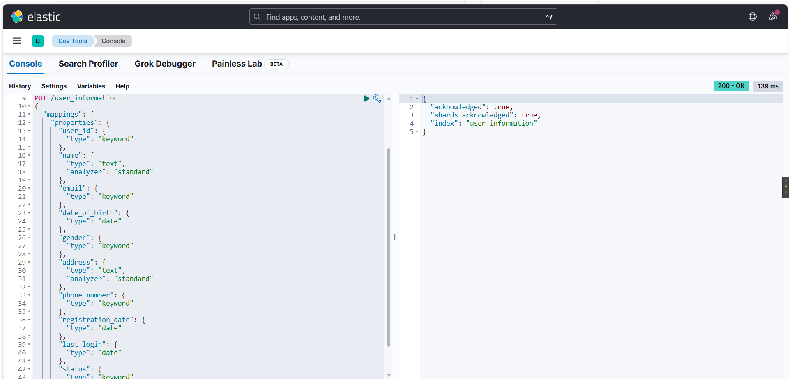
修改索引
```
PUT /user_information/_mapping
{
  "properties": {
    "created_at": {
      "type": "date"
    }
  }
}
```
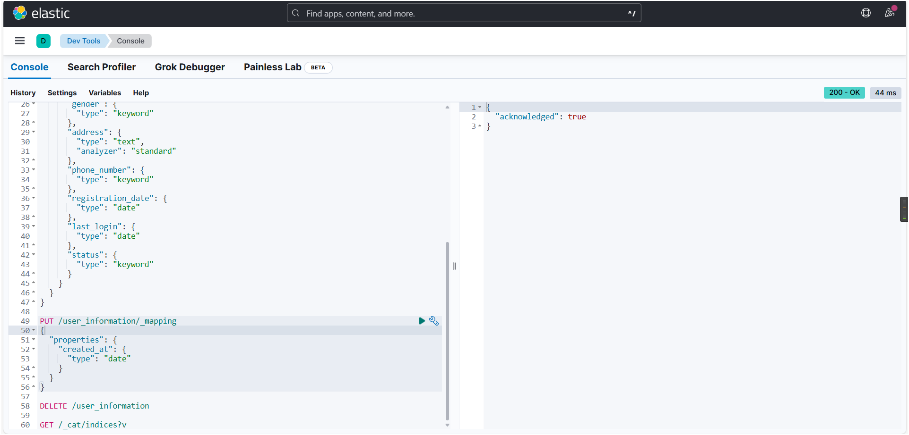
删除索引
```
DELETE /user_information
```
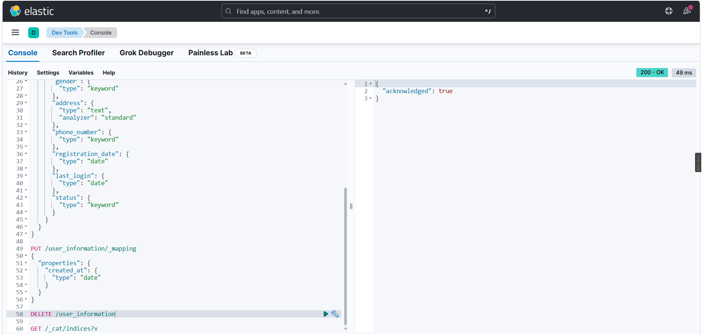
查看所有
```
GET /_cat/indices?v
```
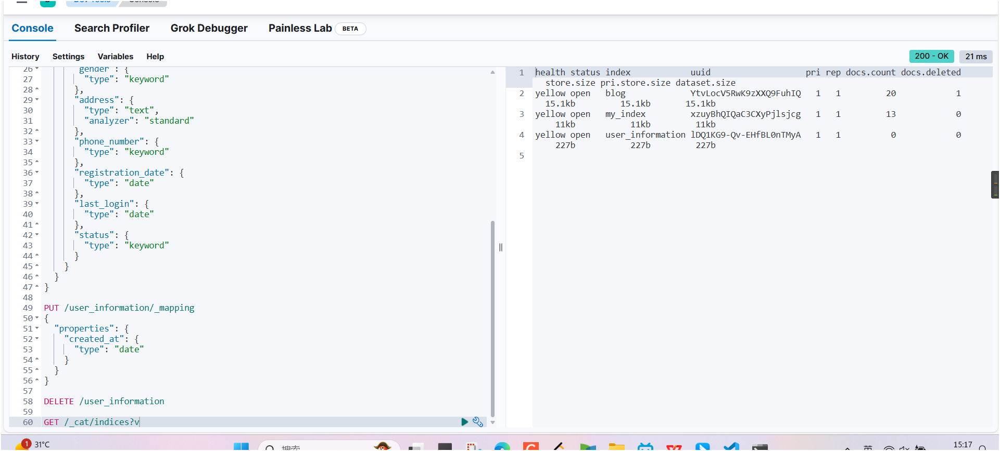
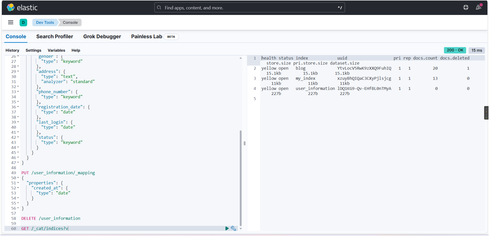

#### 1.2产品目录 (Product Catalog) 索引
创建索引
```
PUT /product_information
{
  "mappings": {
    "properties": {
      "product_id": {
        "type": "keyword"
      },
      "name": {
        "type": "text",
        "analyzer": "standard"
      },
      "description": {
        "type": "text",
        "analyzer": "standard"
      },
      "category": {
        "type": "keyword"
      },
      "price": {
        "type": "double"
      },
      "stock_quantity": {
        "type": "integer"
      },
      "supplier": {
        "type": "keyword"
      },
      "release_date": {
        "type": "date"
      },
      "tags": {
        "type": "keyword"
      },
      "rating": {
        "type": "float"
      }
    }
  }
}
```
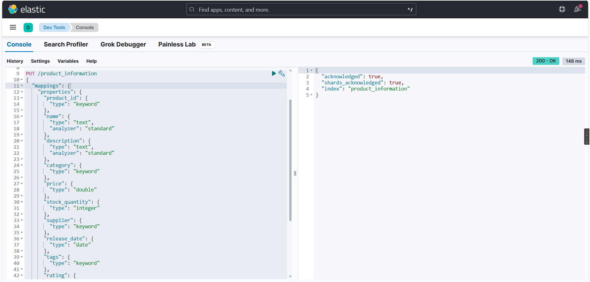
修改索引
```
PUT /product_information/_mapping
{
  "properties": {
    "weight": {
      "type": "double"
    }
  }
}
```
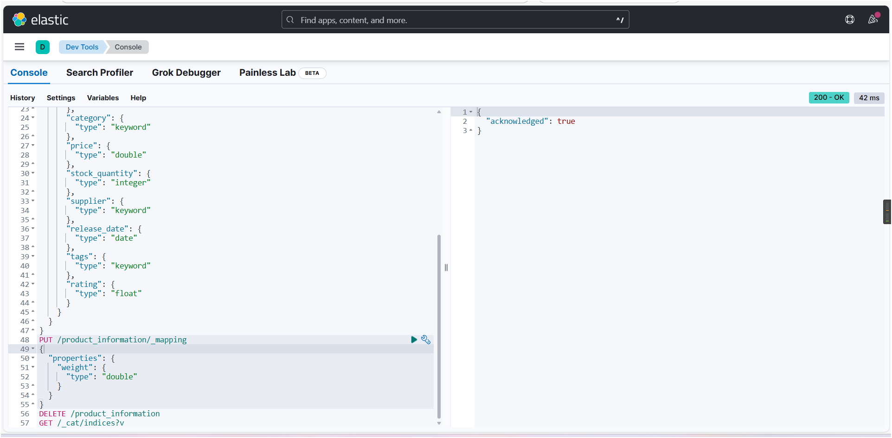
删除索引
```
DELETE /product_information
```
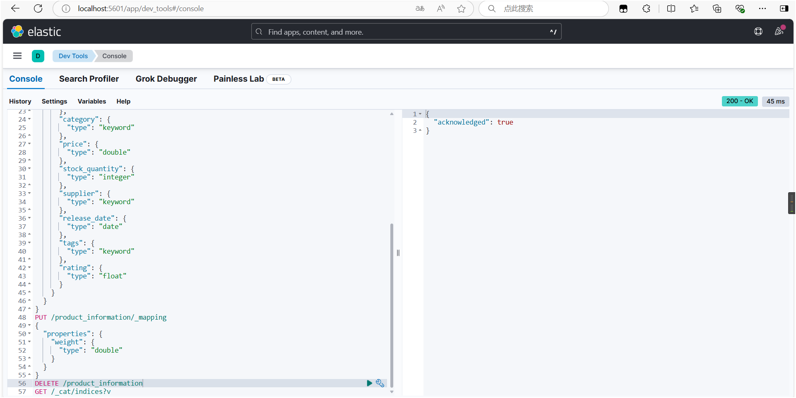
查看所有
```
GET /_cat/indices?v
```
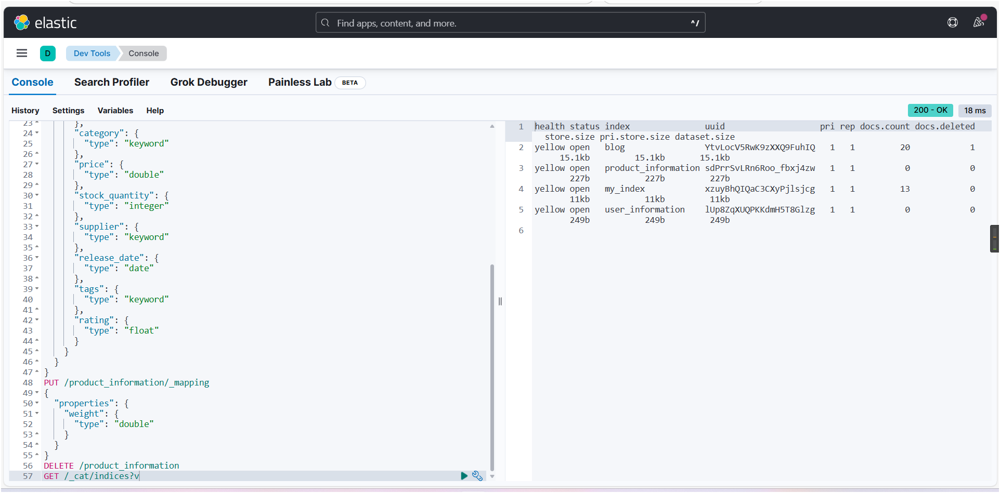
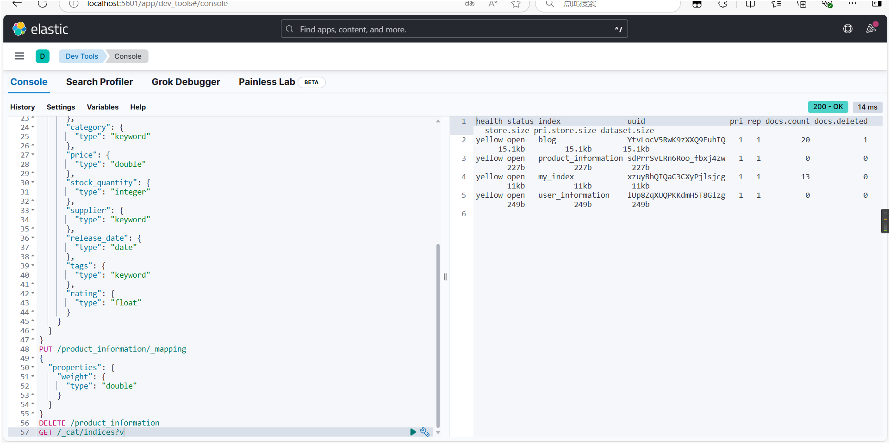
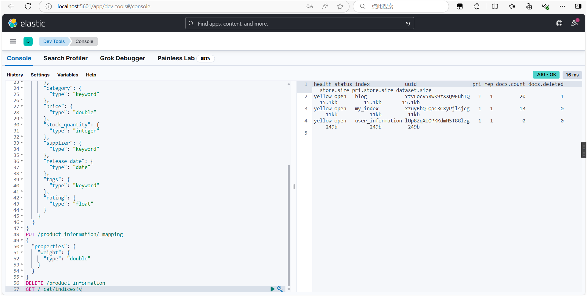
#### 1.3订单记录 (Order Records) 索引字段描述
创建索引
```
PUT /order_information
{
  "mappings": {
    "properties": {
      "order_id": {
        "type": "keyword"
      },
      "customer_id": {
        "type": "keyword"
      },
      "order_date": {
        "type": "date"
      },
      "status": {
        "type": "keyword"
      },
      "total_amount": {
        "type": "double"
      },
      "items": {
        "type": "nested",
        "properties": {
          "product_id": {
            "type": "keyword"
          },
          "quantity": {
            "type": "integer"
          },
          "price": {
            "type": "double"
          }
        }
      },
      "shipping_address": {
        "type": "text",
        "analyzer": "standard"
      },
      "payment_method": {
        "type": "keyword"
      },
      "shipping_date": {
        "type": "date"
      },
      "delivery_date": {
        "type": "date"
      }
    }
  }
}
```

修改索引
```
PUT /order_information/_mapping
{
  "properties": {
    "cancel_date": {
      "type": "date"
    }
  }
}
```
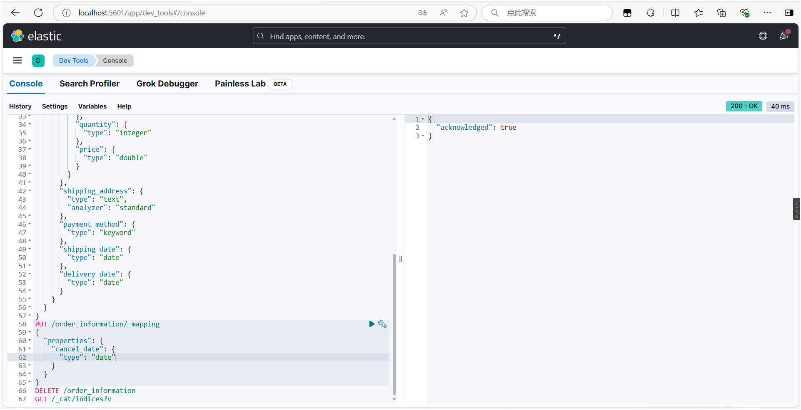
删除索引
```
DELETE /order_information
```
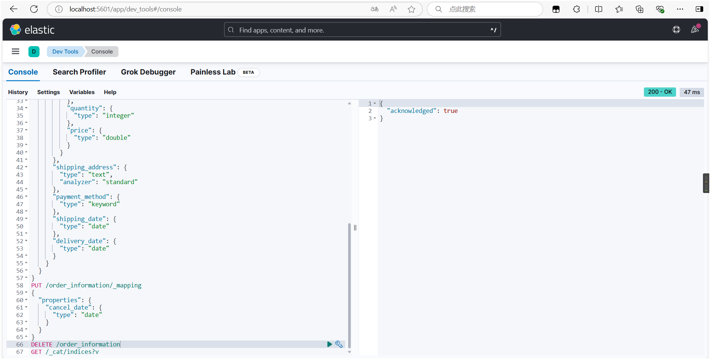
查看所有
```
GET /_cat/indices?v
```
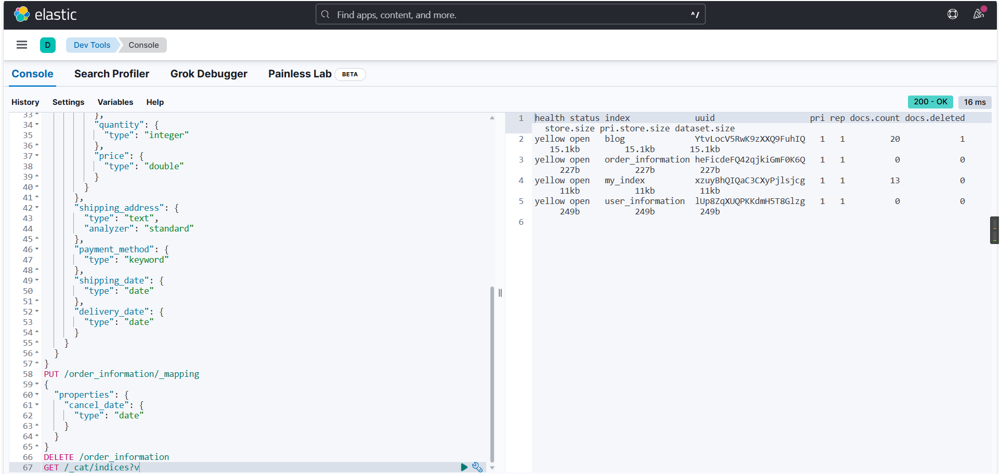

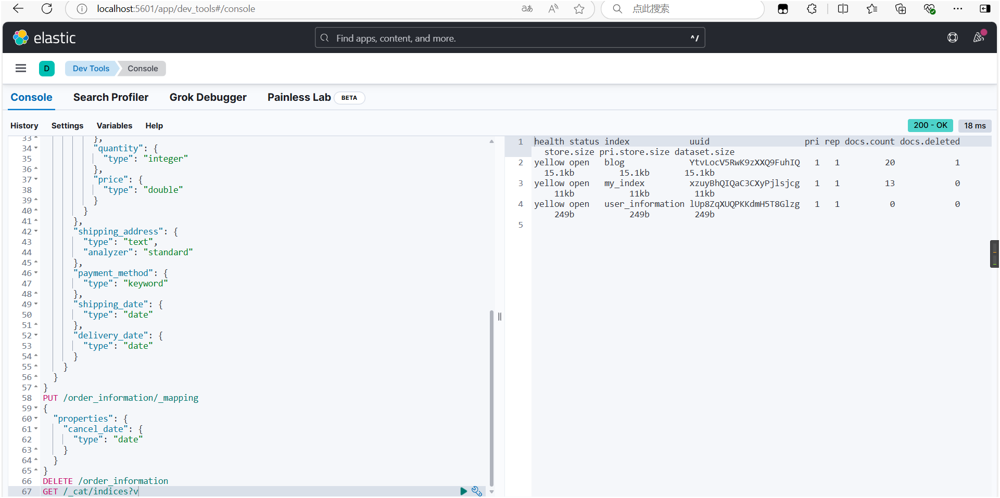
### 2.文档操作练习
要求：文档的CRUD练习
任务二：
1. 创建文档
2. 修改文档(自己设计，修改要合理）
3. 删除文档
4. 查看文档
5. 将下面的Json数据批量导入ES数据库中
#### 2.1用户信息数据
1. 创建文档
```
POST /user_information/_doc/001
{
  "user_id": "001",
  "name": "Alice Johnson",
  "email": "alice.johnson@example.com",
  "date_of_birth": "1990-05-15",
  "gender": "female",
  "address": "123 Main St, Anytown, USA",
  "phone_number": "123-456-7890",
  "registration_date": "2023-01-15",
  "last_login": "2024-09-01",
  "status": "active"
}
```
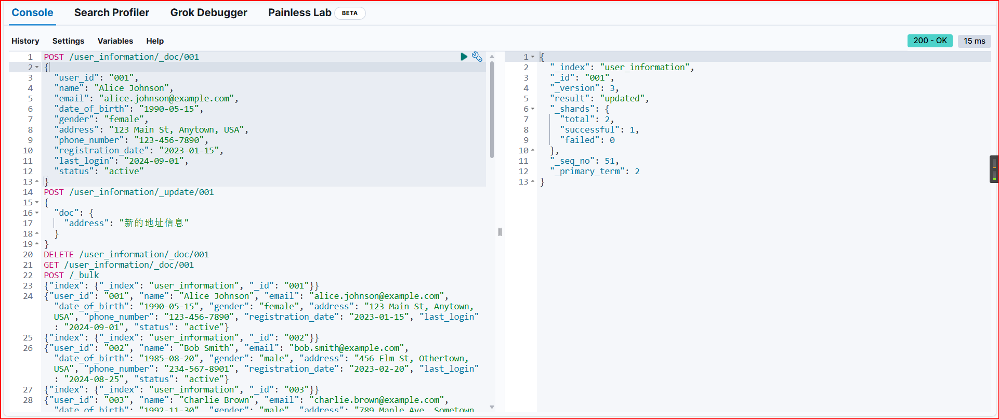
2. 修改文档
```
POST /user_information/_update/001
{
  "doc": {
    "address": "新的地址信息"
  }
}
```
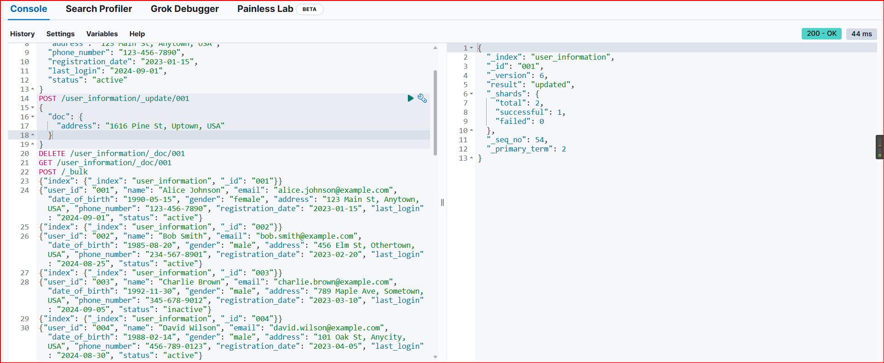
3. 删除文档
```
DELETE /user_information/_doc/001
```
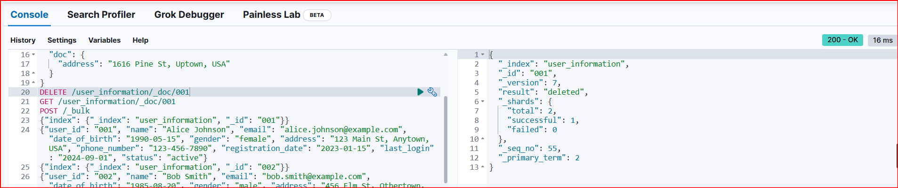
4. 查看文档
```
GET /user_information/_doc/001
```
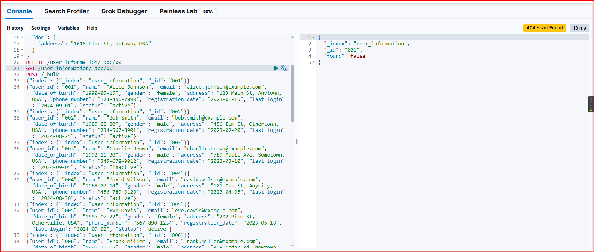
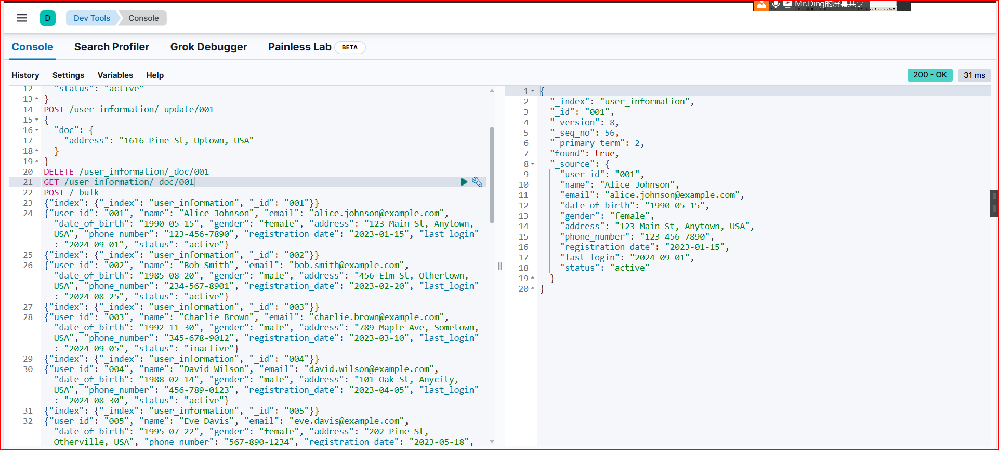
5. 将下面的Json数据批量导入ES数据库中
```
POST /_bulk
{"index": {"_index": "user_information", "_id": "001"}}
{"user_id": "001", "name": "Alice Johnson", "email": "alice.johnson@example.com", "date_of_birth": "1990-05-15", "gender": "female", "address": "123 Main St, Anytown, USA", "phone_number": "123-456-7890", "registration_date": "2023-01-15", "last_login": "2024-09-01", "status": "active"}
{"index": {"_index": "user_information", "_id": "002"}}
{"user_id": "002", "name": "Bob Smith", "email": "bob.smith@example.com", "date_of_birth": "1985-08-20", "gender": "male", "address": "456 Elm St, Othertown, USA", "phone_number": "234-567-8901", "registration_date": "2023-02-20", "last_login": "2024-08-25", "status": "active"}
{"index": {"_index": "user_information", "_id": "003"}}
{"user_id": "003", "name": "Charlie Brown", "email": "charlie.brown@example.com", "date_of_birth": "1992-11-30", "gender": "male", "address": "789 Maple Ave, Sometown, USA", "phone_number": "345-678-9012", "registration_date": "2023-03-10", "last_login": "2024-09-05", "status": "inactive"}
{"index": {"_index": "user_information", "_id": "004"}}
{"user_id": "004", "name": "David Wilson", "email": "david.wilson@example.com", "date_of_birth": "1988-02-14", "gender": "male", "address": "101 Oak St, Anycity, USA", "phone_number": "456-789-0123", "registration_date": "2023-04-05", "last_login": "2024-08-30", "status": "active"}
{"index": {"_index": "user_information", "_id": "005"}}
{"user_id": "005", "name": "Eve Davis", "email": "eve.davis@example.com", "date_of_birth": "1995-07-22", "gender": "female", "address": "202 Pine St, Otherville, USA", "phone_number": "567-890-1234", "registration_date": "2023-05-18", "last_login": "2024-09-02", "status": "active"}
{"index": {"_index": "user_information", "_id": "006"}}
{"user_id": "006", "name": "Frank Miller", "email": "frank.miller@example.com", "date_of_birth": "1991-10-05", "gender": "male", "address": "303 Cedar Rd, Newtown, USA", "phone_number": "678-901-2345", "registration_date": "2023-06-22", "last_login": "2024-09-03", "status": "active"}
{"index": {"_index": "user_information", "_id": "007"}}
{"user_id": "007", "name": "Grace Lee", "email": "grace.lee@example.com", "date_of_birth": "1989-04-17", "gender": "female", "address": "404 Birch Ln, Oldtown, USA", "phone_number": "789-012-3456", "registration_date": "2023-07-30", "last_login": "2024-09-04", "status": "inactive"}
{"index": {"_index": "user_information", "_id": "008"}}
{"user_id": "008", "name": "Hannah White", "email": "hannah.white@example.com", "date_of_birth": "1993-12-25", "gender": "female", "address": "505 Spruce St, Littletown, USA", "phone_number": "890-123-4567", "registration_date": "2023-08-15", "last_login": "2024-09-06", "status": "active"}
{"index": {"_index": "user_information", "_id": "009"}}
{"user_id": "009", "name": "Ivy Green", "email": "ivy.green@example.com", "date_of_birth": "1994-03-03", "gender": "female", "address": "606 Willow Ave, Bigcity, USA", "phone_number": "901-234-5678", "registration_date": "2023-09-01", "last_login": "2024-09-07", "status": "active"}
{"index": {"_index": "user_information", "_id": "010"}}
{"user_id": "010", "name": "Jack Black", "email": "jack.black@example.com", "date_of_birth": "1987-06-18", "gender": "male", "address": "707 Poplar Dr, Smalltown, USA", "phone_number": "012-345-6789", "registration_date": "2023-10-10", "last_login": "2024-09-08", "status": "inactive"}
{"index": {"_index": "user_information", "_id": "011"}}
{"user_id": "011", "name": "Karen Adams", "email": "karen.adams@example.com", "date_of_birth": "1990-09-21", "gender": "female", "address": "808 Chestnut Blvd, Metropolis, USA", "phone_number": "123-456-7890", "registration_date": "2023-11-25", "last_login": "2024-09-09", "status": "active"}
{"index": {"_index": "user_information", "_id": "012"}}
{"user_id": "012", "name": "Leo King", "email": "leo.king@example.com", "date_of_birth": "1986-01-12", "gender": "male", "address": "909 Ash Ct, Villagetown, USA", "phone_number": "234-567-8901", "registration_date": "2023-12-05", "last_login": "2024-09-10", "status": "active"}
{"index": {"_index": "user_information", "_id": "013"}}
{"user_id": "013", "name": "Mia Moore", "email": "mia.moore@example.com", "date_of_birth": "1992-02-28", "gender": "female", "address": "1010 Fir Ln, Hamlet, USA", "phone_number": "345-678-9012", "registration_date": "2024-01-10", "last_login": "2024-09-11", "status": "inactive"}
{"index": {"_index": "user_information", "_id": "014"}}
{"user_id": "014", "name": "Nina Scott", "email": "nina.scott@example.com", "date_of_birth"："1988-05-05"， "gender": "female", "address": "1111 Cypress St, Township, USA", "phone_number": "456-789-0123", "registration_date": "2024-02-14", "last_login": "2024-09-12", "status": "active"}
{"index": {"_index": "user_information", "_id": "015"}}
{"user_id": "015", "name": "Oscar Turner", "email": "oscar.turner@example.com", "date_of_birth": "1991-07-19", "gender": "male", "address": "1212 Redwood Rd, Cityville, USA", "phone_number": "567-890-1234", "registration_date": "2024-03-20", "last_login": "2024-09-13", "status": "active"}
{"index": {"_index": "user_information", "_id": "016"}}
{"user_id": "016", "name": "Paul Walker", "email": "paul.walker@example.com", "date_of_birth": "1989-10-10", "gender": "male", "address": "1313 Cherry Ave, Urbantown, USA", "phone_number": "678-901-2345", "registration_date": "2024-04-25", "last_login": "2024-09-14", "status": "inactive"}
{"index": {"_index": "user_information", "_id": "017"}}
{"user_id": "017", "name": "Quinn Hughes", "email": "quinn.hughes@example.com", "date_of_birth": "1993-11-11", "gender": "male", "address": "1414 Beech St, Suburbia, USA", "phone_number": "789-012-3456", "registration_date": "2024-05-30", "last_login": "2024-09-15", "status": "active"}
{"index": {"_index": "user_information", "_id": "018"}}
{"user_id": "018", "name": "Rose Hall", "email": "rose.hall@example.com", "date_of_birth": "1990-03-22", "gender": "female", "address": "1515 Palm Dr, Downtown, USA", "phone_number": "890-123-4567", "registration_date": "2024-06-15", "last_login": "2024-09-16", "status": "active"}
{"index": {"_index": "user_information", "_id": "019"}}
{"user_id": "019", "name": "Steve Young", "email": "steve.young@example.com", "date_of_birth": "1987-09-09", "gender": "male", "address": "1616 Pine St, Uptown, USA", "phone_number": "901-234-5678", "registration_date": "2024-07-20", "last_login": "2024-09-17", "status": "inactive"}
{"index": {"_index": "user_information", "_id": "020"}}
{"user_id": "020", "name": "Tina Brown", "email": "tina.brown@example.com", "date_of_birth": "1994-12-12", "gender": "female", "address": "1717 Maple Ave, Seaside, USA", "phone_number": "012-345-6789", "registration_date": "2024-08-10", "last_login": "2024-09-18", "status": "active"}
```
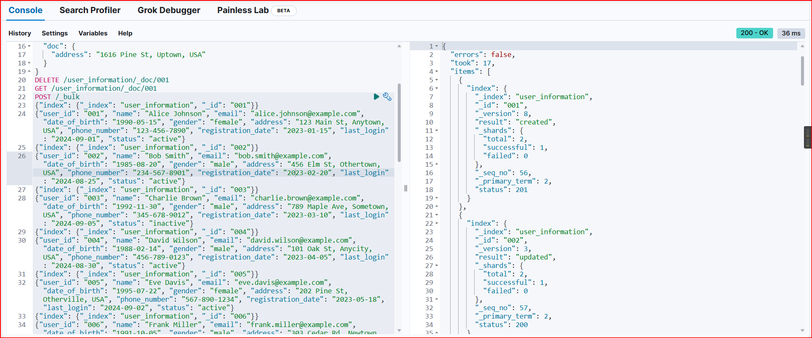
#### 2.2产品目录数据
1. 创建文档
```
POST /products/_doc/P001
{
  "product_id": "P001",
  "name": "Wireless Mouse",
  "description": "A high precision wireless mouse with ergonomic design.",
  "category": "Electronics",
  "price": 29.99,
  "stock_quantity": 150,
  "supplier": "TechCorp",
  "release_date": "2023-01-15",
  "tags": ["wireless", "mouse", "electronics"],
  "rating": 4.5
}
```
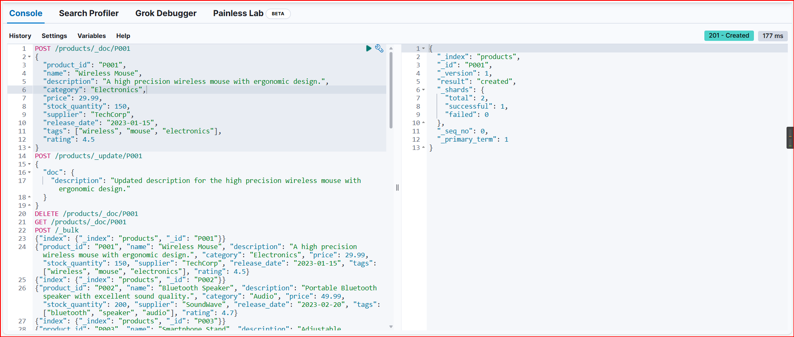
2. 修改文档
```
POST /products/_update/P001
{
  "doc": {
    "description": "Updated description for the high precision wireless mouse with ergonomic design."
  }
}
```
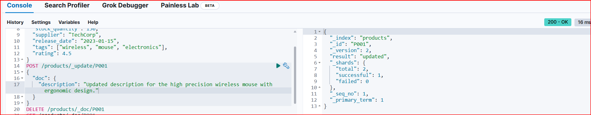
3. 删除文档
```
DELETE /products/_doc/P001
```
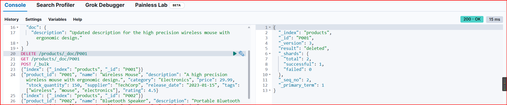
4. 查看文档
```
GET /products/_doc/P001
```
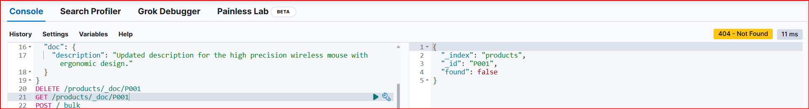

5. 将下面的Json数据批量导入ES数据库中
```
POST /_bulk
{"index": {"_index": "products", "_id": "P001"}}
{"product_id": "P001", "name": "Wireless Mouse", "description": "A high precision wireless mouse with ergonomic design.", "category": "Electronics", "price": 29.99, "stock_quantity": 150, "supplier": "TechCorp", "release_date": "2023-01-15", "tags": ["wireless", "mouse", "electronics"], "rating": 4.5}
{"index": {"_index": "products", "_id": "P002"}}
{"product_id": "P002", "name": "Bluetooth Speaker", "description": "Portable Bluetooth speaker with excellent sound quality.", "category": "Audio", "price": 49.99, "stock_quantity": 200, "supplier": "SoundWave", "release_date": "2023-02-20", "tags": ["bluetooth", "speaker", "audio"], "rating": 4.7}
{"index": {"_index": "products", "_id": "P003"}}
{"product_id": "P003", "name": "Smartphone Stand", "description": "Adjustable smartphone stand for hands-free viewing.", "category": "Accessories", "price": 15.99, "stock_quantity": 300, "supplier": "GadgetPlus", "release_date": "2023-03-10", "tags": ["smartphone", "stand", "accessories"], "rating": 4.3}
{"index": {"_index": "products", "_id": "P004"}}
{"product_id": "P004", "name": "USB-C Charger", "description": "Fast charging USB-C charger compatible with most devices.", "category": "Chargers", "price": 19.99, "stock_quantity": 250, "supplier": "ChargeMaster", "release_date": "2023-04-05", "tags": ["usb-c", "charger", "electronics"], "rating": 4.6}
{"index": {"_index": "products", "_id": "P005"}}
{"product_id": "P005", "name": "Noise Cancelling Headphones", "description": "Over-ear headphones with active noise cancellation.", "category": "Audio", "price": 89.99, "stock_quantity": 100, "supplier": "AudioTech", "release_date": "2023-05-18", "tags": ["noise cancelling", "headphones", "audio"], "rating": 4.8}
{"index": {"_index": "products", "_id": "P006"}}
{"product_id": "P006","name": "4K Monitor","description": "Ultra HD 4K monitor with stunning display quality.","category": "Monitors","price": 299.99,"stock_quantity": 80,"supplier": "ViewPerfect","release_date": "2023-06-22","tags": ["4k", "monitor", "electronics"],"rating": 4.9}
{"index": {"_index": "products", "_id": "P007"}}
{"product_id": "P007","name": "Gaming Keyboard","description": "Mechanical keyboard with customizable RGB lighting.","category": "Gaming","price": 59.99,"stock_quantity": 120,"supplier": "GameGear","release_date": "2023-07-30","tags": ["gaming", "keyboard", "electronics"],"rating": 4.4}
{"index": {"_index": "products", "_id": "P008"}}
{"product_id": "P008","name": "Fitness Tracker","description": "Smart fitness tracker with heart rate monitor.","category": "Wearables","price": 39.99,"stock_quantity": 180,"supplier": "FitLife","release_date": "2023-08-15","tags": ["fitness", "tracker", "wearables"],"rating": 4.2}
{"index": {"_index": "products", "_id": "P009"}}
{"product_id": "P009","name": "Electric Toothbrush","description": "Rechargeable electric toothbrush with multiple modes.","category": "Personal Care","price": 34.99,"stock_quantity": 140,"supplier": "SmileBright","release_date": "2023-09-01","tags": ["electric", "toothbrush", "personal care"],"rating": 4.5}
{"index": {"_index": "products", "_id": "P010"}}
{"product_id": "P010","name": "Smart Thermostat","description": "Wi-Fi enabled smart thermostat with energy saving features.","category": "Home Automation","price": 129.99,"stock_quantity": 90,"supplier": "HomeSmart","release_date": "2023-10-10","tags": ["smart", "thermostat", "home automation"],"rating": 4.7}
{"index": {"_index": "products", "_id": "P011"}}
{"product_id": "P011","name": "LED Desk Lamp","description": "Adjustable LED desk lamp with touch control.","category": "Lighting","price": 24.99,"stock_quantity": 160,"supplier": "BrightLight","release_date": "2023-11-25","tags": ["led", "desk lamp", "lighting"],"rating": 4.3}
{"index": {"_index": "products", "_id": "P012"}}
{"product_id": "P012","name": "Portable Hard Drive","description": "1TB portable hard drive with fast data transfer.","category": "Storage","price": 64.99,"stock_quantity": 110,"supplier": "DataSafe","release_date": "2023-12-05","tags": ["portable", "hard drive", "storage"],"rating": 4.6}
{"index": {"_index": "products", "_id": "P013"}}
{"product_id": "P013","name": "Coffee Maker","description": "Automatic coffee maker with programmable settings.","category": "Kitchen Appliances","price": 79.99,"stock_quantity": 130,"supplier": "BrewMaster","release_date": "2024-01-10","tags": ["coffee", "maker", "appliances"],"rating": 4.4}
{"index": {"_index": "products", "_id": "P014"}}
{"product_id": "P014","name": "Smart Light Bulb","description": "Color changing smart light bulb with app control.","category": "Lighting","price": 14.99,"stock_quantity": 220,"supplier": "LightSmart","release_date": "2024-02-14","tags": ["smart", "light bulb", "lighting"],"rating": 4.2}
{"index": {"_index": "products", "_id": "P015"}}
{"product_id": "P015","name": "Electric Kettle","description": "Quick boil electric kettle with auto shut-off.","category": "Kitchen Appliances","price": 29.99,"stock_quantity": 170,"supplier": "QuickBoil","release_date": "2024-03-20","tags": ["electric", "kettle", "appliances"],"rating": 4.5}
{"index": {"_index": "products", "_id": "P016"}}
{"product_id": "P016","name": "Robot Vacuum","description": "Smart robot vacuum cleaner with scheduling features.","category": "Home Appliances","price": 199.99,"stock_quantity": 60,"supplier": "CleanBot","release_date": "2024-04-25","tags": ["robot", "vacuum", "home appliances"],"rating": 4.8}
{"index": {"_index": "products", "_id": "P017"}}
{"product_id": "P017","name": "Digital Camera","description": "Compact digital camera with high resolution.","category": "Photography","price": 149.99,"stock_quantity": 95,"supplier": "PhotoSnap","release_date": "2024-05-30","tags": ["digital", "camera", "photography"],"rating": 4.7}
{"index": {"_index": "products", "_id": "P018"}}
{"product_id": "P018","name": "Smartwatch","description": "Feature-rich smartwatch with fitness tracking.","category": "Wearables","price": 99.99,"stock_quantity": 140,"supplier": "WristTech","release_date": "2024-06-15","tags": ["smartwatch", "wearables", "fitness"],"rating": 4.4}
{"index": {"_index": "products", "_id": "P019"}}
{"product_id": "P019","name": "Air Fryer","description": "Healthier cooking with a digital air fryer.","category": "Kitchen Appliances","price": 89.99,"stock_quantity": 115,"supplier": "HealthyCook","release_date": "2024-07-20","tags": ["air fryer", "kitchen", "appliances"],"rating": 4.6}
{"index": {"_index": "products", "_id": "P020"}}
{"product_id": "P020", "name": "Electric Scooter", "description": "Eco-friendly electric scooter with long battery life.", "category": "Transportation", "price": 299.99, "stock_quantity": 50, "supplier": "EcoRide", "release_date": "2024-08-10", "tags": ["electric", "scooter", "transportation"], "rating": 4.7}
```
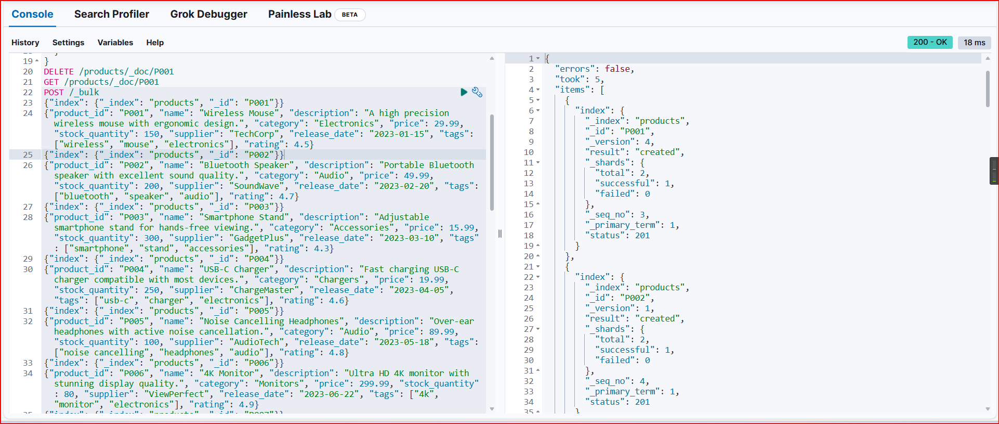
#### 2.3订单记录数据
1. 创建文档
```
POST /orders/_doc/OR001
{
  "order_id": "OR001",
  "customer_id": "C001",
  "order_date": "2024-01-10",
  "status": "completed",
  "total_amount": 150.75,
  "items": [
    {
      "product_id": "P001",
      "quantity": 2,
      "price": 50.00
    },
    {
      "product_id": "P002",
      "quantity": 1,
      "price": 50.75
    }
  ],
  "shipping_address": "123 Main St, Anytown, USA",
  "payment_method": "credit_card",
  "shipping_date": "2024-01-11",
  "delivery_date": "2024-01-15"
}
```
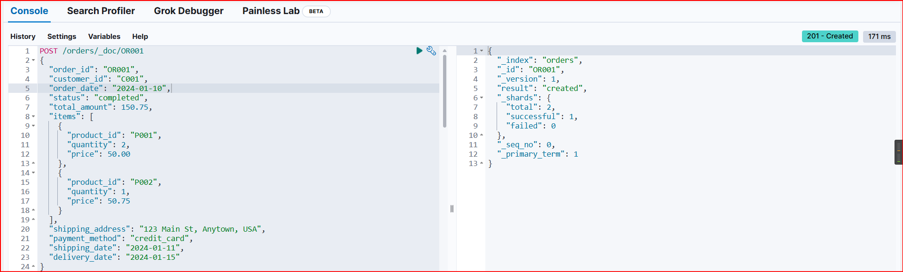
2. 修改文档
```
POST /orders/_update/OR001
{
  "doc": {
    "status": "shipped"
  }
}
```
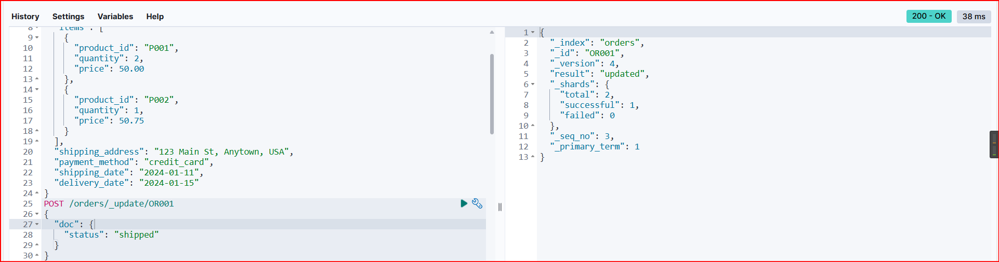
3. 删除文档
```
DELETE /orders/_doc/OR001
```
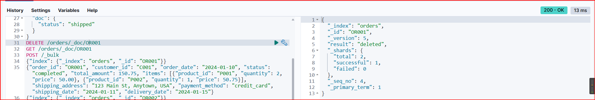
4. 查看文档
```
GET /orders/_doc/OR001
```
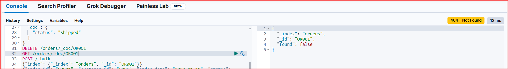
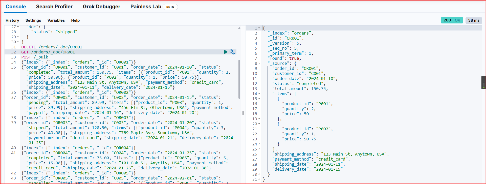
5. 将下面的Json数据批量导入ES数据库中
```
POST /_bulk
{"index": {"_index": "orders", "_id": "OR001"}}
{"order_id": "OR001", "customer_id": "C001", "order_date": "2024-01-10", "status": "completed", "total_amount": 150.75, "items": [{"product_id": "P001", "quantity": 2, "price": 50.00}, {"product_id": "P002", "quantity": 1, "price": 50.75}], "shipping_address": "123 Main St, Anytown, USA", "payment_method": "credit_card", "shipping_date": "2024-01-11", "delivery_date": "2024-01-15"}
{"index": {"_index": "orders", "_id": "OR002"}}
{"order_id": "OR002", "customer_id": "C002", "order_date": "2024-01-15", "status": "pending", "total_amount": 89.99, "items": [{"product_id": "P003", "quantity": 1, "price": 89.99}], "shipping_address": "456 Elm St, Othertown, USA", "payment_method": "paypal", "shipping_date": "2024-01-16", "delivery_date": "2024-01-20"}
{"index": {"_index": "orders", "_id": "OR003"}}
{"order_id": "OR003", "customer_id": "C003", "order_date": "2024-01-20", "status": "shipped", "total_amount": 120.50, "items": [{"product_id": "P004", "quantity": 3, "price": 40.00}], "shipping_address": "789 Maple Ave, Sometown, USA", "payment_method": "debit_card", "shipping_date": "2024-01-21", "delivery_date": "2024-01-25"}
{"index": {"_index": "orders", "_id": "OR004"}}
{"order_id": "OR004", "customer_id": "C004", "order_date": "2024-01-25", "status": "completed", "total_amount": 75.00, "items": [{"product_id": "P005", "quantity": 5, "price": 15.00}], "shipping_address": "101 Oak St, Anycity, USA", "payment_method": "credit_card", "shipping_date": "2024-01-26", "delivery_date": "2024-01-30"}
{"index": {"_index": "orders", "_id": "OR005"}}
{"order_id": "OR005", "customer_id": "C005", "order_date": "2024-02-01", "status": "cancelled", "total_amount": 200.00, "items": [{"product_id": "P006", "quantity": 2, "price": 100.00}], "shipping_address": "202 Pine St, Otherville, USA", "payment_method": "bank_transfer", "shipping_date": "2024-02-02", "delivery_date": "2024-02-06"}
{"index": {"_index": "orders", "_id": "OR006"}}
{"order_id": "OR006", "customer_id": "C006", "order_date": "2024-02-05", "status": "completed", "total_amount": 300.25, "items": [{"product_id": "P007", "quantity": 1, "price": 300.25}], "shipping_address": "303 Cedar Rd, Newtown, USA", "payment_method": "credit_card", "shipping_date": "2024-02-06", "delivery_date": "2024-02-10"}
{"index": {"_index": "orders", "_id": "OR007"}}
{"order_id": "OR007", "customer_id": "C007", "order_date": "2024-02-10", "status": "pending", "total_amount": 45.99, "items": [{"product_id": "P008", "quantity": 3, "price": 15.33}], "shipping_address": "404 Birch Ln, Oldtown, USA", "payment_method": "paypal", "shipping_date": "2024-02-11", "delivery_date": "2024-02-15"}
{"index": {"_index": "orders", "_id": "OR008"}}
{"order_id": "OR008", "customer_id": "C008", "order_date": "2024-02-15", "status": "shipped", "total_amount": 89.50, "items": [{"product_id": "P009", "quantity": 2, "price": 44.75}], "shipping_address": "505 Spruce St, Littletown, USA", "payment_method": "debit_card", "shipping_date": "2024-02-16", "delivery_date": "2024-02-20"}
{"index": {"_index": "orders", "_id": "OR009"}}
{"order_id": "OR009", "customer_id": "C009", "order_date": "2024-02-20", "status": "completed", "total_amount": 60.00, "items": [{"product_id": "P010", "quantity": 4, "price": 15.00}], "shipping_address": "606 Willow Ave, Bigcity, USA", "payment_method": "credit_card", "shipping_date": "2024-02-21", "delivery_date": "2024-02-25"}
{"index": {"_index": "orders", "_id": "OR010"}}
{"order_id": "OR010", "customer_id": "C010", "order_date": "2024-02-25", "status": "cancelled", "total_amount": 150.00, "items": [{"product_id": "P011", "quantity": 10, "price": 15.00}], "shipping_address": "707 Poplar Dr, Smalltown, USA", "payment_method": "bank_transfer", "shipping_date": "2024-02-26", "delivery_date": "2024-03-01"}
{"index": {"_index": "orders", "_id": "OR011"}}
{"order_id": "OR011", "customer_id": "C011", "order_date": "2024-03-01", "status": "completed", "total_amount": 110.00, "items": [{"product_id": "P012", "quantity": 2, "price": 55.00}], "shipping_address": "808 Chestnut Blvd, Metropolis, USA", "payment_method": "credit_card", "shipping_date": "2024-03-02", "delivery_date": "2024-03-06"}
{"index": {"_index": "orders", "_id": "OR012"}}
{"order_id": "OR012", "customer_id": "C012", "order_date": "2024-03-05", "status": "pending", "total_amount": 75.99, "items": [{"product_id": "P013", "quantity": 3, "price": 25.33}], "shipping_address": "909 Ash Ct, Villagetown, USA", "payment_method": "paypal", "shipping_date": "2024-03-06", "delivery_date": "2024-03-10"}
{"index": {"_index": "orders", "_id": "OR013"}}
{"order_id": "OR013", "customer_id": "C013", "order_date": "2024-03-10", "status": "shipped", "total_amount": 200.00, "items": [{"product_id": "P014", "quantity": 4, "price": 50.00}], "shipping_address": "1010 Fir Ln, Hamlet, USA", "payment_method": "debit_card", "shipping_date": "2024-03-11", "delivery_date": "2024-03-15"}
{"index": {"_index": "orders", "_id": "OR014"}}
{"order_id": "OR014", "customer_id": "C014", "order_date": "2024-03-15", "status": "completed", "total_amount": 90.00, "items": [{"product_id": "P015", "quantity": 6, "price": 15.00}], "shipping_address": "1111 Cypress St, Township, USA", "payment_method": "credit_card", "shipping_date": "2024-03-16", "delivery_date": "2024-03-20"}
{"index": {"_index": "orders", "_id": "OR015"}}
{"order_id": "OR015", "customer_id": "C015", "order_date": "2024-03-20", "status": "cancelled", "total_amount": 135.00, "items": [{"product_id": "P016", "quantity": 9, "price": 15.00}], "shipping_address": "1212 Redwood Rd, Cityville, USA", "payment_method": "bank_transfer", "shipping_date": "2024-03-21", "delivery_date": "2024-03-25"}
{"index": {"_index": "orders", "_id": "OR016"}}
{"order_id": "OR016", "customer_id": "C016", "order_date": "2024-03-25", "status": "completed", "total_amount": 250.00, "items": [{"product_id": "P017", "quantity": 5, "price": 50.00}], "shipping_address": "1313 Cherry Ave, Urbantown, USA", "payment_method": "credit_card", "shipping_date": "2024-03-26", "delivery_date": "2024-03-30"}
{"index": {"_index": "orders", "_id": "OR017"}}
{"order_id": "OR017", "customer_id": "C017", "order_date": "2024-03-30", "status": "pending", "total_amount": 60.00, "items": [{"product_id": "P018", "quantity": 2, "price": 30.00}], "shipping_address": "1414 Beech St, Suburbia, USA", "payment_method": "paypal", "shipping_date": "2024-03-31", "delivery_date": "2024-04-04"}
{"index": {"_index": "orders", "_id": "OR018"}}
{"order_id": "OR018", "customer_id": "C018", "order_date": "2024-04-04", "status": "shipped", "total_amount": 100.00, "items": [{"product_id": "P019", "quantity": 4, "price": 25.00}], "shipping_address": "1515 Palm Dr, Downtown, USA", "payment_method": "debit_card", "shipping_date": "2024-04-05", "delivery_date": "2024-04-09"}
{"index": {"_index": "orders", "_id": "OR019"}}
{"order_id": "OR019", "customer_id": "C019", "order_date": "2024-04-09", "status": "completed", "total_amount": 180.00, "items": [{"product_id": "P020", "quantity": 6, "price": 30.00}], "shipping_address": "1616 Pine St, Uptown, USA", "payment_method": "credit_card", "shipping_date": "2024-04-10", "delivery_date": "2024-04-14"}
{"index": {"_index": "orders", "_id": "OR020"}}
{"order_id": "OR020", "customer_id": "C020", "order_date": "2024-04-14", "status": "cancelled", "total_amount": 220.00, "items": [{"product_id": "P021", "quantity": 11, "price": 20.00}], "shipping_address": "1717 Maple Ave, Seaside, USA", "payment_method": "bank_transfer", "shipping_date": "2024-04-15", "delivery_date": "2024-04-19"}
```
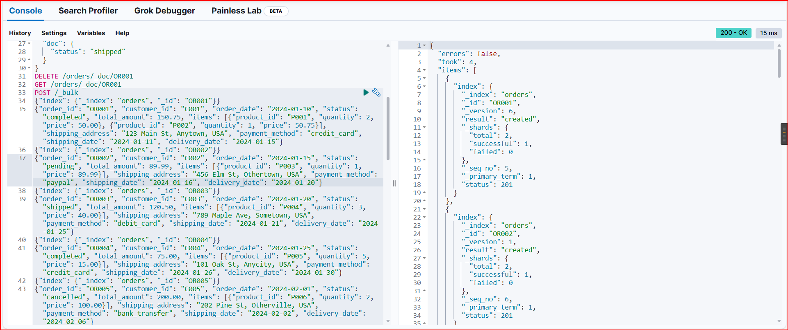
### 3.高级查询&DSL练习
任务三：
完成下面的30道练习题
#### 3.1用户信息数据
1. 查询所有女性用户的姓名和电子邮件。
```
GET /user_information/_search
{
  "query": {
    "match": {
      "gender": "female"
    }
  },
  "_source": ["name", "email"]
}
```
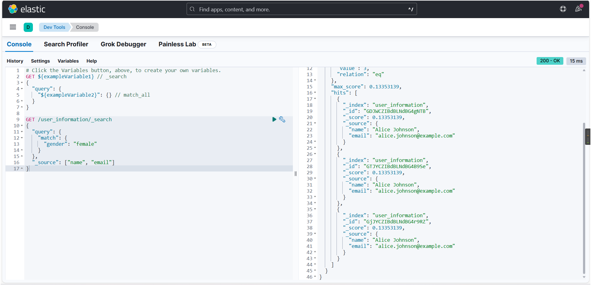
2. 查找最后登录日期在2024年9月1日之后的所有活跃用户。
```
GET /user_information/_search
{
  "query": {
    "bool": {
      "must": [
        {"range": {"last_login": {"gte": "2024-09-01"}}},
        {"term": {"status": "active"}}
      ]
    }
  }
}
```
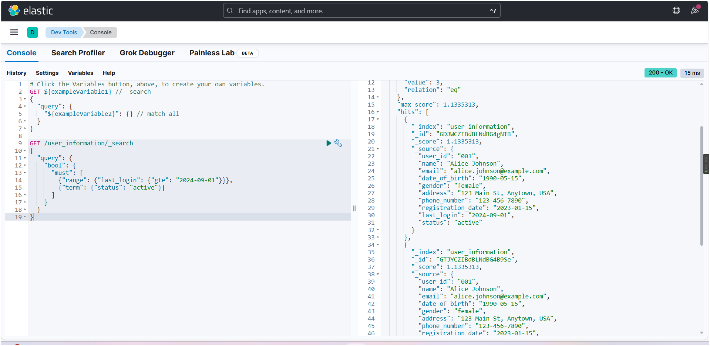
3. 查询住在"Anytown"的用户。
```
GET /user_information/_search
{
  "query": {
    "match": {
      "address": "Anytown"
    }
  }
}
```
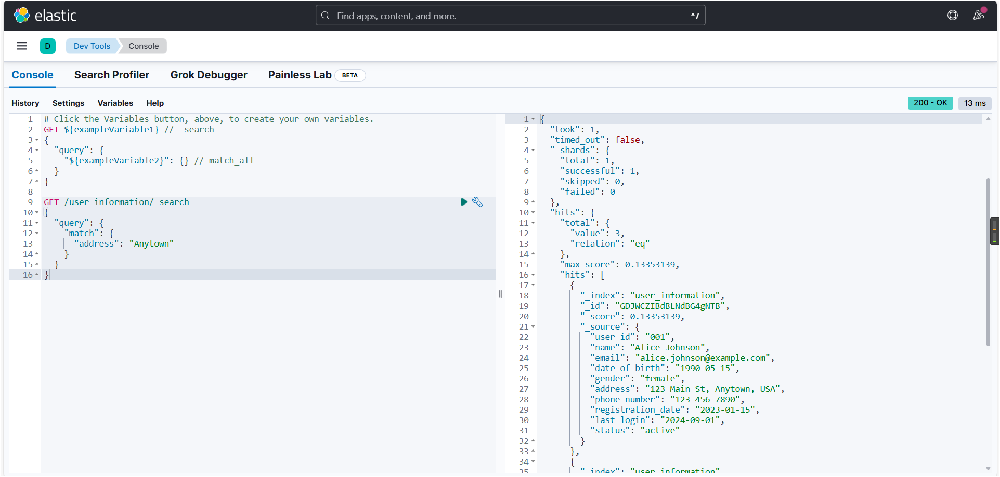
4. 查找出生日期在1990年之后的所有用户。
```
GET /user_information/_search
{
  "query": {
    "range": {
      "date_of_birth": {
        "gte": "1990-01-01"
      }
    }
  }
}
```
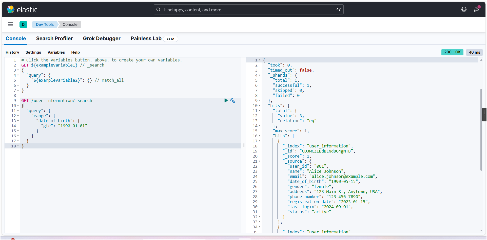
5. 查询所有状态为"inactive"的用户。
```
GET /user_information/_search
{
  "query": {
    "term": {
      "status": "inactive"
    }
  }
}
```
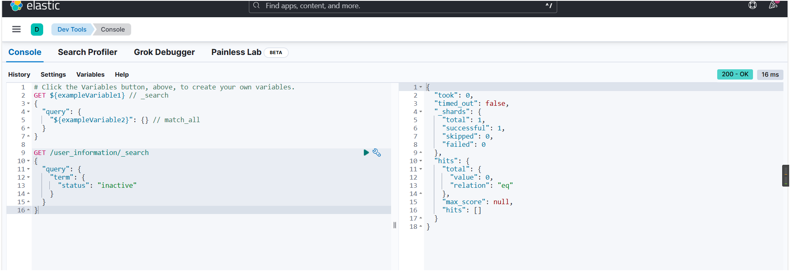
6. 查找注册日期在2023年1月1日到2023年12月31日之间的用户。
```
GET /user_information/_search
{
  "query": {
    "range": {
      "registration_date": {
        "gte": "2023-01-01",
        "lte": "2023-12-31"
      }
    }
  }
}
```
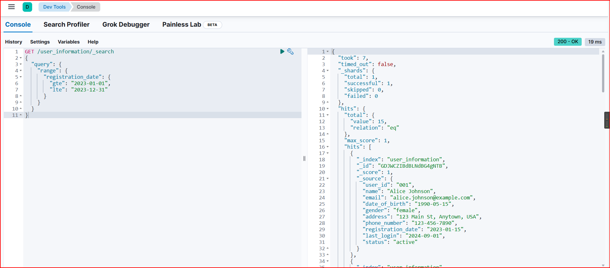
7. 查询名字为"Bob Smith"的用户的详细信息。
```
GET /user_information/_search
{
  "query": {
    "match": {
      "name": "Bob Smith"
    }
  }
}
```
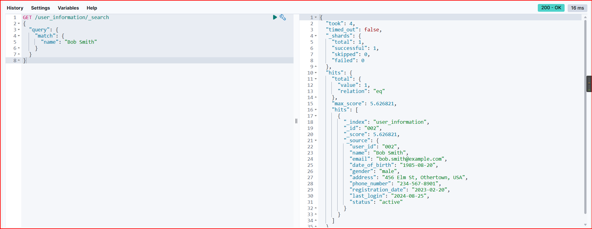
8. 查找电话号码以"123"开头的用户。
```
GET /user_information/_search
{
  "query": {
    "prefix": {
      "phone_number": "123"
    }
  }
}
```
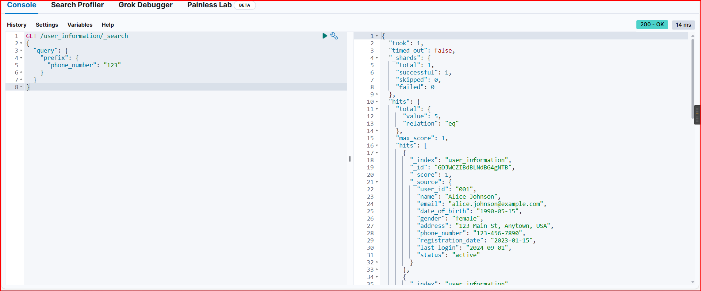
9.  查询电子邮件域为"example.com"的所有用户。
```
GET /user_information/_search
{
  "query": {
    "regexp": {
      "email": ".*example\\.com"
    }
  }
}
```
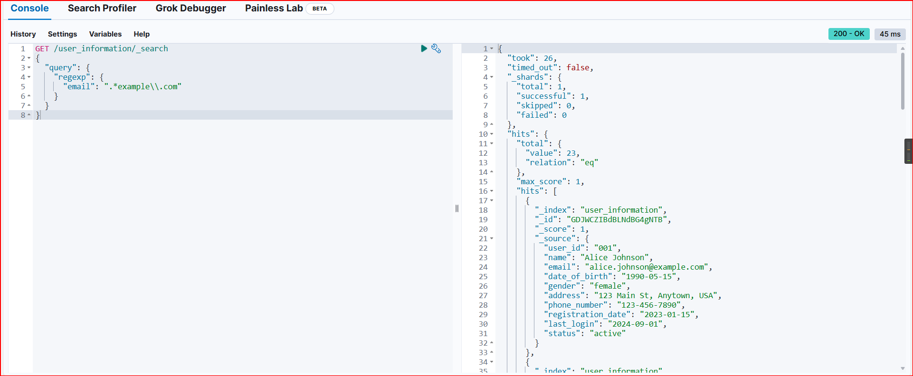
10.   查找所有名字中包含"Lee"的用户。
```
GET /user_information/_search
{
  "query": {
    "wildcard": {
      "name": "*Lee*"
    }
  }
}
```

#### 3.2产品目录数据
1. 查询所有类别为"Audio"的产品名称和价格。
```
GET /products/_search
{
  "query": {
    "term": {
      "category": "Audio"
    }
  },
  "_source": ["name", "price"]
}
```
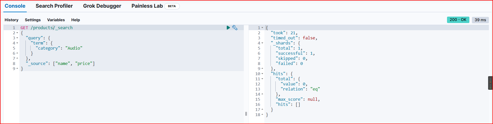
2. 查找价格高于50美元的所有产品。
```
GET /products/_search
{
  "query": {
    "range": {
      "price": {
        "gt": 50
      }
    }
  }
}
```
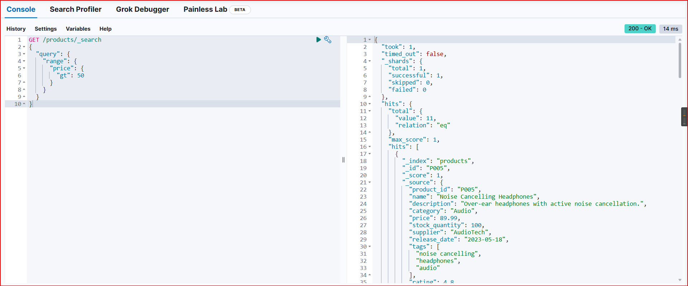
3. 查询库存数量少于100的产品。
```
GET /products/_search
{
  "query": {
    "range": {
      "stock_quantity": {
        "lt": 100
      }
    }
  }
}
```
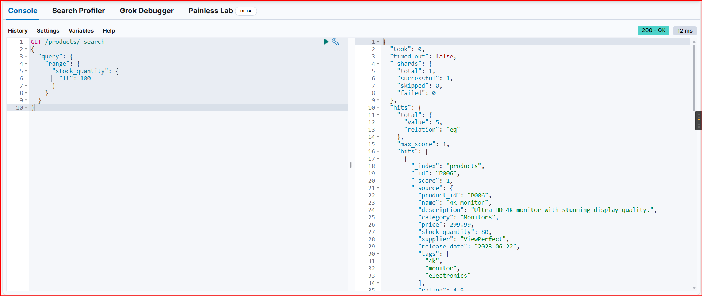
4. 查找评分高于4.5的所有产品。
```
GET /products/_search
{
  "query": {
    "range": {
      "rating": {
        "gt": 4.5
      }
    }
  }
}
```
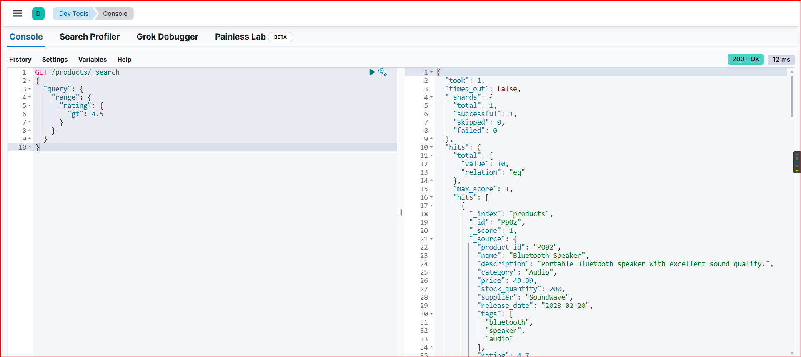
5. 查询标签中包含"smart"的所有产品。
```
GET /products/_search
{
  "query": {
    "terms": {
      "tags": ["smart"]
    }
  }
}
```
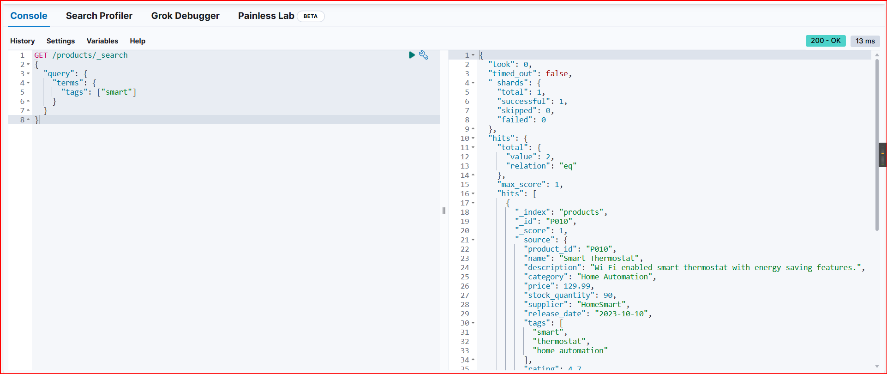
6. 查找供应商为"TechCorp"的产品。
```
GET /products/_search
{
  "query": {
    "term": {
      "supplier": "TechCorp"
    }
  }
}
```
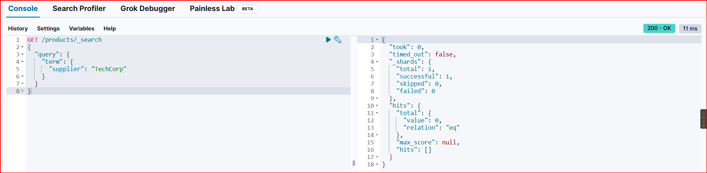
7. 查询发布日期在2023年6月1日之后的所有产品。
```
GET /products/_search
{
  "query": {
    "range": {
      "release_date": {
        "gte": "2023-06-01"
      }
    }
  }
}
```
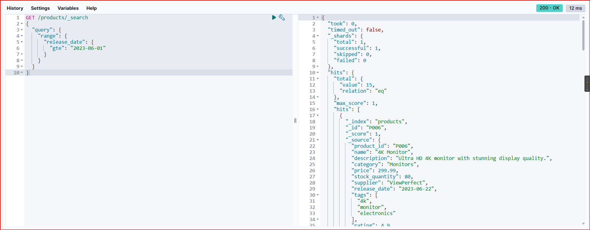
8. 查找描述中包含"wireless"的产品。
```
GET /products/_search
{
  "query": {
    "match": {
      "description": "wireless"
    }
  }
}
```
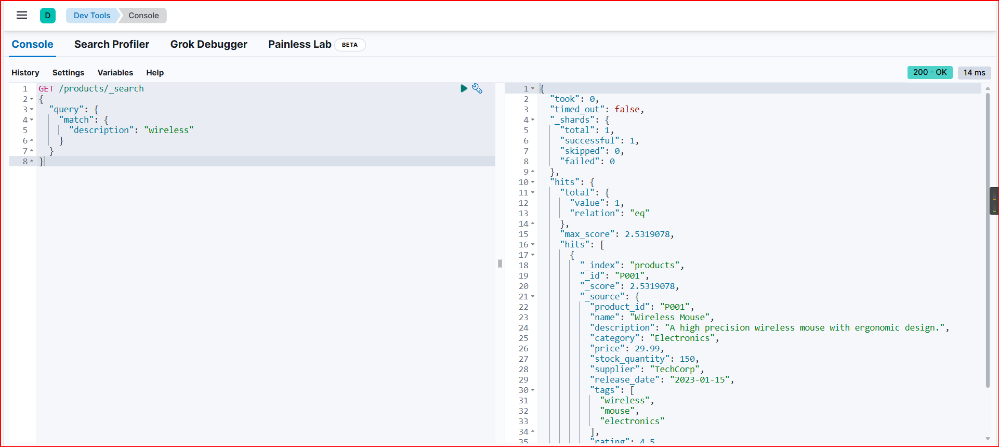
9.  查询价格在20美元到100美元之间的所有产品。
```
GET /products/_search
{
  "query": {
    "range": {
      "price": {
        "gte": 20,
        "lte": 100
      }
    }
  }
}
```
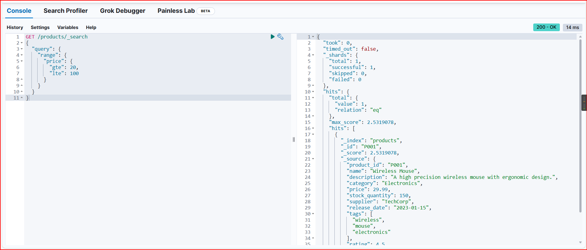
10.   查找产品名称中包含"Light"的所有产品。
```
GET /products/_search
{
  "query": {
    "match": {
      "name": "Light"
    }
  }
}
```
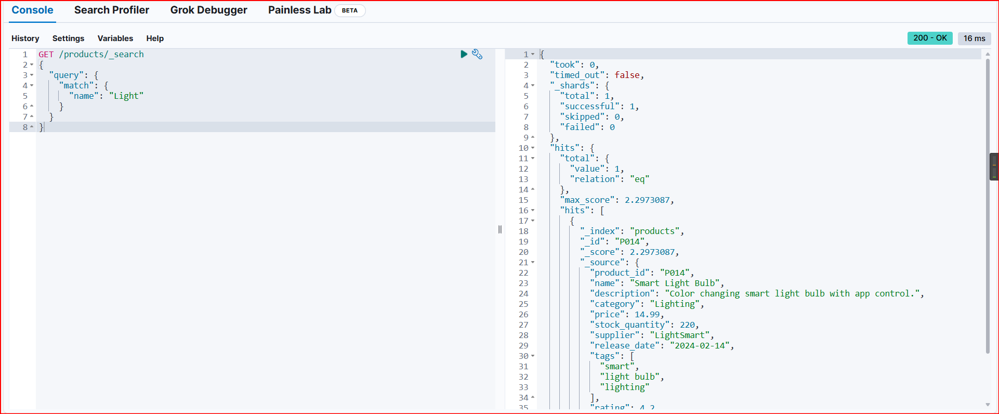
#### 3.3订单记录数据
1. 查询所有状态为"completed"的订单的订单ID和总金额。
```
GET /orders/_search
{
  "query": {
    "term": {
      "status": "completed"
    }
  },
  "_source": ["order_id", "total_amount"]
}
```
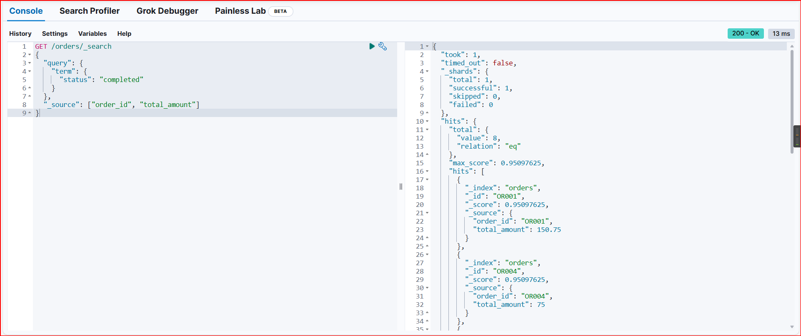
2. 查找总金额大于100美元的所有订单。
```
GET /orders/_search
{
  "query": {
    "range": {
      "total_amount": {
        "gt": 100
      }
    }
  }
}
```
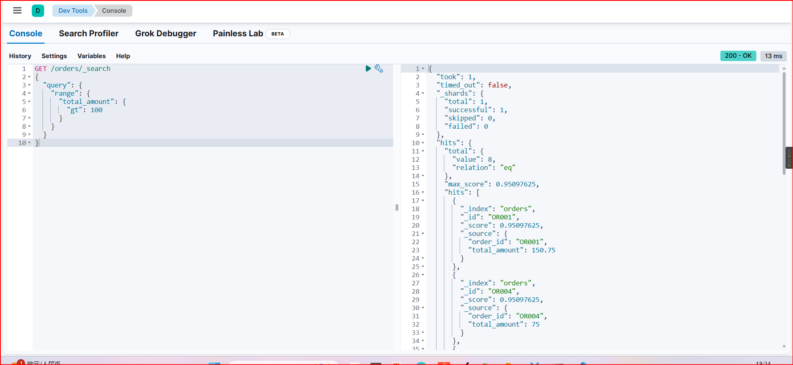
3. 查询支付方式为"paypal"的订单。
```
GET /orders/_search
{
  "query": {
    "term": {
      "payment_method": "paypal"
    }
  }
}
```
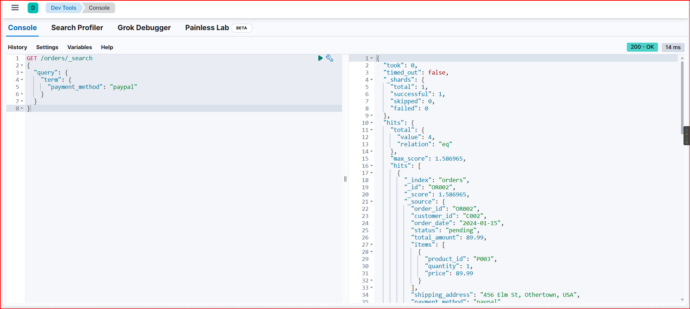
4. 查找订单日期在2024年2月之后的所有订单。
```
GET /orders/_search
{
  "query": {
    "range": {
      "order_date": {
        "gte": "2024-02-01"
      }
    }
  }
}
```
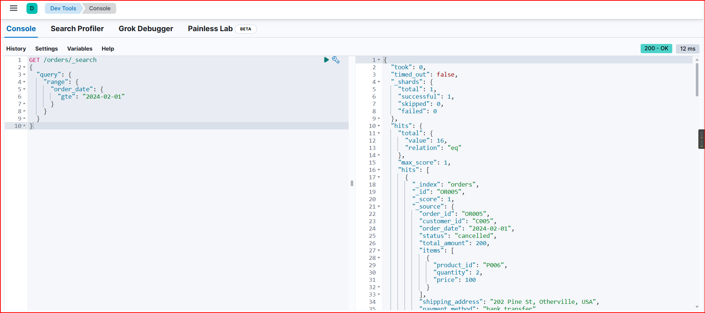
5. 查询包含产品ID为"P001"的订单。
```
GET /orders/_search
{
  "query": {
    "nested": {
      "path": "items",
      "query": {
        "bool": {
          "must": {
            "term": {
              "items.product_id": "P001"
            }
          }
        }
      }
    }
  }
}
```
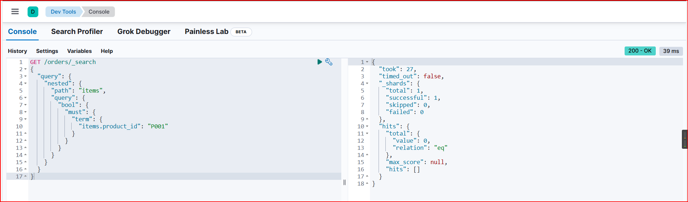
6. 查找所有状态为"cancelled"的订单的客户ID。
```
GET /orders/_search
{
  "query": {
    "term": {
      "status": "cancelled"
    }
  },
  "_source": ["customer_id"]
}
```
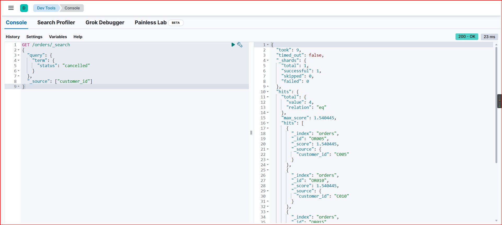
7. 查询发货日期在2024年1月15日之前的订单。
```
GET /orders/_search
{
  "query": {
    "range": {
      "shipping_date": {
        "lt": "2024-01-15"
      }
    }
  }
}
```
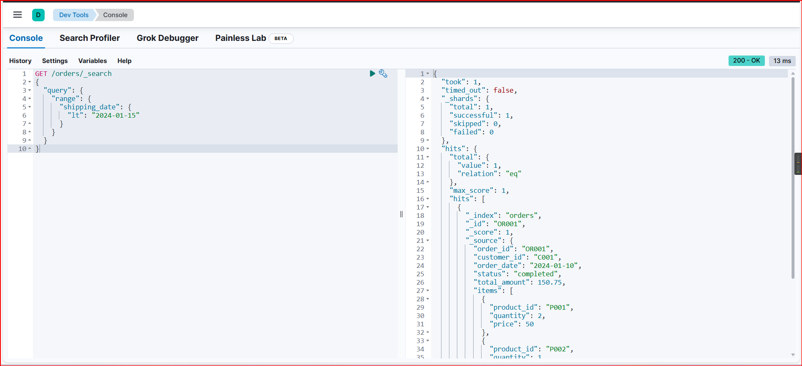
8. 查找使用"credit_card"支付的订单。
```
GET /orders/_search
{
  "query": {
    "term": {
      "payment_method": "credit_card"
    }
  }
}
```
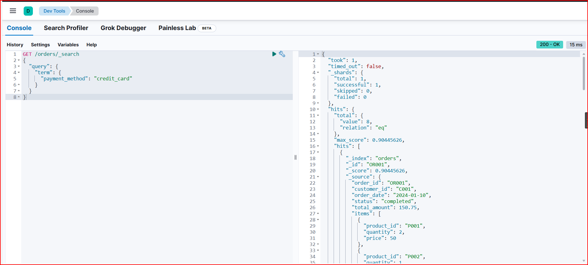
9.  查询总金额在50美元到200美元之间的所有订单。
```
GET /orders/_search
{
  "query": {
    "range": {
      "total_amount": {
        "gte": 50,
        "lte": 200
      }
    }
  }
}
```
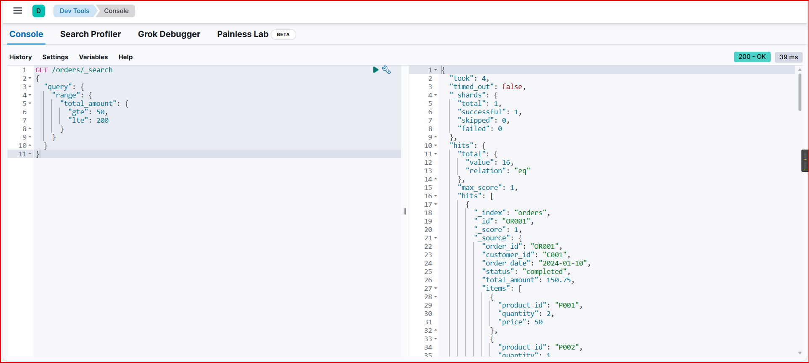
10.   查找订单ID中包含"OR01"的所有订单。
```
GET /orders/_search
{
  "query": {
    "wildcard": {
      "order_id": "*OR01*"
    }
  }
}
```
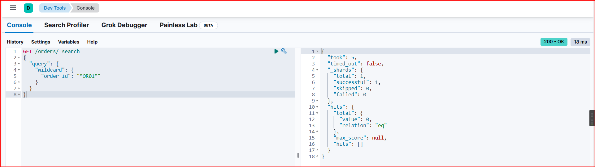
## 四、问题与解决
问题：items字段没有定义为一个嵌套字段，而是被定义为一个常规对象。不能使用嵌套查询来查找包含特定product_id的订单。
解决：1. 删除旧索引；2. 创建新的索引映射；3. 重新导入数据；4. 执行查询。
代码：
```
#删除旧索引
DELETE /orders
#创建新的索引映射
PUT /orders
{
  "mappings": {
    "properties": {
      "customer_id": {
        "type": "text",
        "fields": {
          "keyword": {
            "type": "keyword",
            "ignore_above": 256
          }
        }
      },
      "delivery_date": {
        "type": "date"
      },
      "items": {
        "type": "nested",
        "properties": {
          "price": {
            "type": "float"
          },
          "product_id": {
            "type": "text",
            "fields": {
              "keyword": {
                "type": "keyword",
                "ignore_above": 256
              }
            }
          },
          "quantity": {
            "type": "long"
          }
        }
      },
      "order_date": {
        "type": "date"
      },
      "order_id": {
        "type": "text",
        "fields": {
          "keyword": {
            "type": "keyword",
            "ignore_above": 256
          }
        }
      },
      "payment_method": {
        "type": "text",
        "fields": {
          "keyword": {
            "type": "keyword",
            "ignore_above": 256
          }
        }
      },
      "shipping_address": {
        "type": "text",
        "fields": {
          "keyword": {
            "type": "keyword",
            "ignore_above": 256
          }
        }
      },
      "shipping_date": {
        "type": "date"
      },
      "status": {
        "type": "text",
        "fields": {
          "keyword": {
            "type": "keyword",
            "ignore_above": 256
          }
        }
      },
      "total_amount": {
        "type": "float"
      }
    }
  }
}
#执行查询
GET /orders/_search
{
  "query": {
    "nested": {
      "path": "items",
      "query": {
        "bool": {
          "must": {
            "term": {
              "items.product_id": "P001"
            }
          }
        }
      }
    }
  }
}
```