# 课程名称：高级数据库技术与应用
## 实验五 Kibana 操作
> 学院：省级示范性软件学院
题目：《实验五 Kibana 操作》
姓名：胡展奕
学号：2100160349
班级：软工2201班
日期：2024-11-11
实验环境：Elasticsearch8.12.2 Kibana8.12.2
---
### 一、实验内容
>Kibana 操作练习
### 二、实验目的
>1.掌握Kibana的基本操作。
2.学习如何在Kibana中进行数据聚合。
3.制作并展示Kibana仪表盘。
### 三、实验步骤
**要求：**
>1.使用Kibana可视化图表完成的 10道题
2.将做好的10个可视化放到1个或2个仪表盘中
3.仪表盘中增加一些控件，文字描述，筛选等

#### 可视化图
1. 统计每个产品类别的总销售额。
```
GET /ecommerce/_search
{
  "size": 0,
  "aggs": {
    "total_sales_per_category": {
      "terms": {
        "field": "product_category.keyword",
        "size": 10
      },
      "aggs": {
        "total_sales": {
          "sum": {
            "field": "total_amount"
          }
        }
      }
    }
  }
}
```
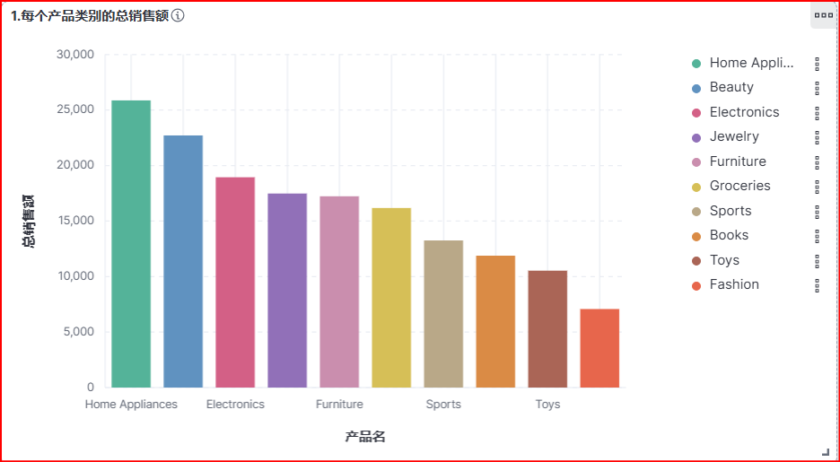
2. 计算每个城市的平均订单金额。
```
GET /ecommerce/_search
{
  "size": 0,
  "aggs": {
    "average_order_amount_per_city": {
      "terms": {
        "field": "customer_city.keyword"
      },
      "aggs": {
        "average_order_amount": {
          "avg": {
            "field": "total_amount"
          }
        }
      }
    }
  }
}
```
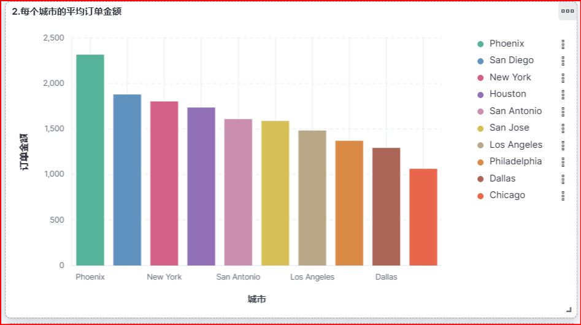
3. 找出销量最高的前5个产品。
```
GET /ecommerce/_search
{
  "size": 0,
  "aggs": {
    "top_5_products_by_sales": {
      "terms": {
        "field": "product_name.keyword",
        "size": 5,
        "order": {
          "total_quantity": "desc"
        }
      },
      "aggs": {
        "total_quantity": {
          "sum": {
            "field": "quantity"
          }
        }
      }
    }
  }
}
```
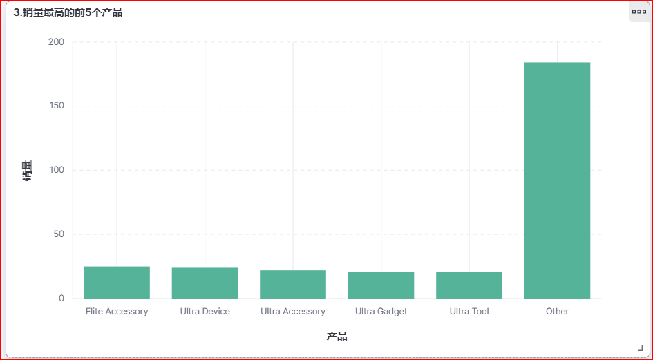
4. 计算男性和女性客户的平均年龄。
```
GET /ecommerce/_search
{
  "size": 0,
  "aggs": {
    "average_age_by_gender": {
      "terms": {
        "field": "customer_gender.keyword"
      },
      "aggs": {
        "average_age": {
          "avg": {
            "field": "customer_age"
          }
        }
      }
    }
  }
}
```
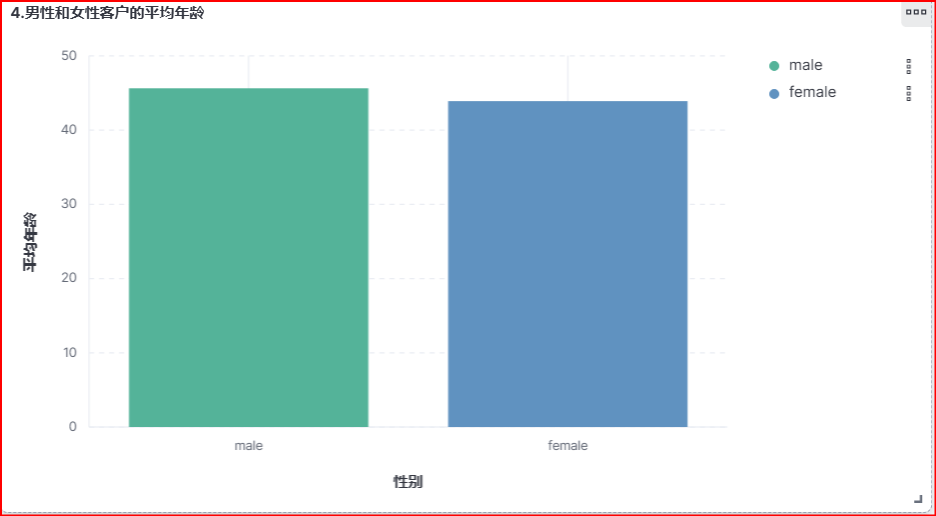
5. 统计每种支付方式的使用次数和总金额。
```
GET /ecommerce/_search
{
  "size": 0,
  "aggs": {
    "payment_method_stats": {
      "terms": {
        "field": "payment_method.keyword"
      },
      "aggs": {
        "count": {
          "value_count": {
            "field": "order_id"
          }
        },
        "total_amount": {
          "sum": {
            "field": "total_amount"
          }
        }
      }
    }
  }
}
```
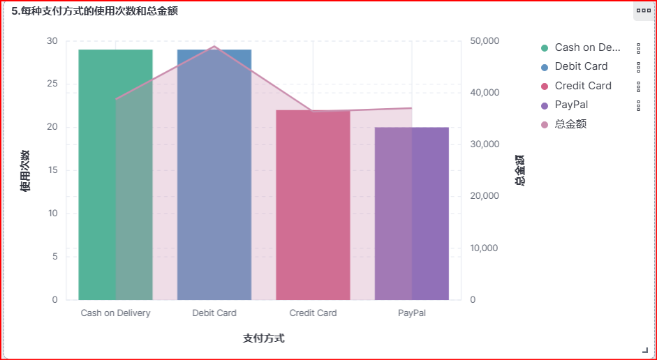
6. 计算每月的总销售额。
```
GET /ecommerce/_search
{
  "size": 0,
  "aggs": {
    "monthly_sales": {
      "date_histogram": {
        "field": "order_date",
        "calendar_interval": "month",
        "format": "yyyy-MM"
      },
      "aggs": {
        "total_sales": {
          "sum": {
            "field": "total_amount"
          }
        }
      }
    }
  }
}
```
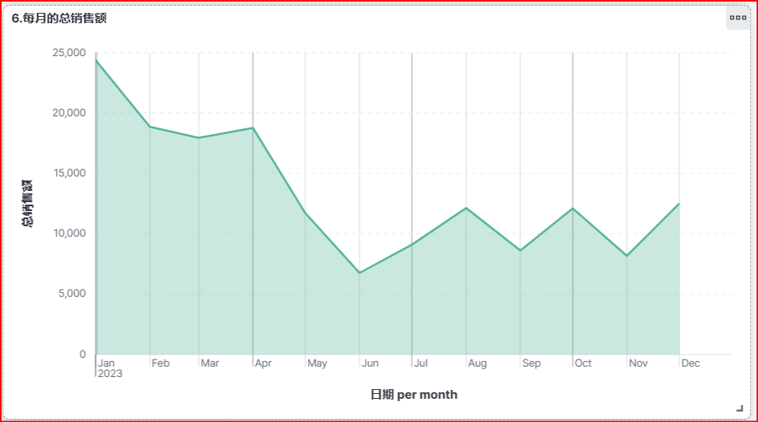
7. 找出平均订单金额最高的前3个客户。
```
GET /ecommerce/_search
{
  "size": 0,
  "aggs": {
    "top_3_customers_by_average_order_amount": {
      "terms": {
        "field": "customer_id.keyword",
        "size": 3,
        "order": {
          "average_order_amount": "desc"
        }
      },
      "aggs": {
        "average_order_amount": {
          "avg": {
            "field": "total_amount"
          }
        }
      }
    }
  }
}
```
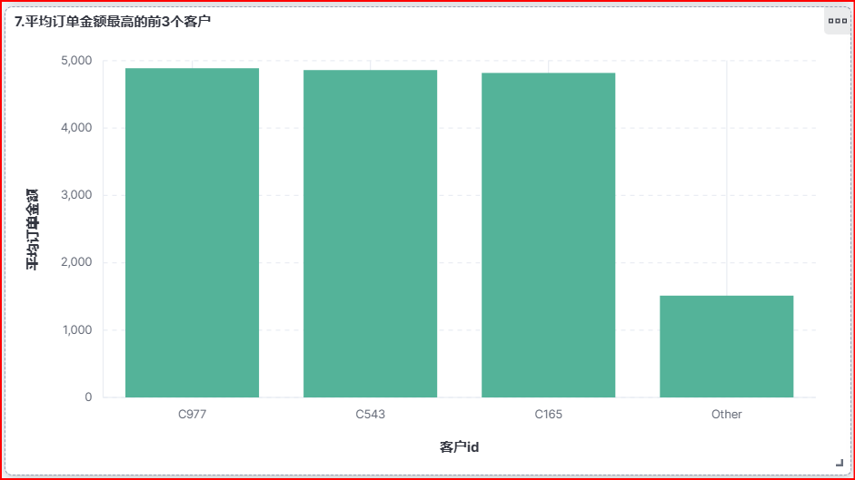
8. 计算每个年龄段（18-30，31-50，51+）的客户数量。
```
GET /ecommerce/_search
{
  "size": 0,
  "aggs": {
    "customer_counts_by_age_group": {
      "range": {
        "field": "customer_age",
        "ranges": [
          { "from": 18, "to": 30 },
          { "from": 31, "to": 50 },
          { "from": 51 }
        ]
      }
    }
  }
}
```
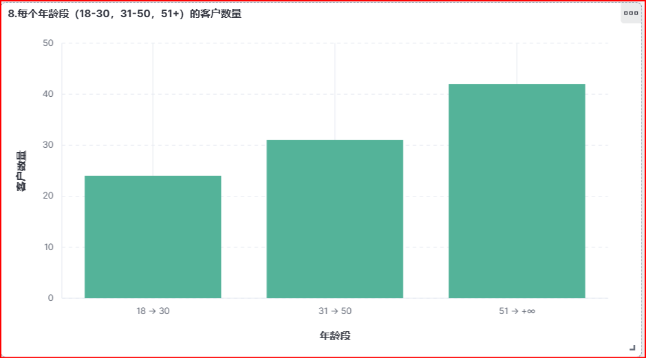
9. 计算每个产品类别的平均单价。
```
GET /ecommerce/_search
{
  "size": 0,
  "aggs": {
    "average_price_per_category": {
      "terms": {
        "field": "product_category.keyword"
      },
      "aggs": {
        "average_price": {
          "avg": {
            "field": "price"
          }
        }
      }
    }
  }
}
```
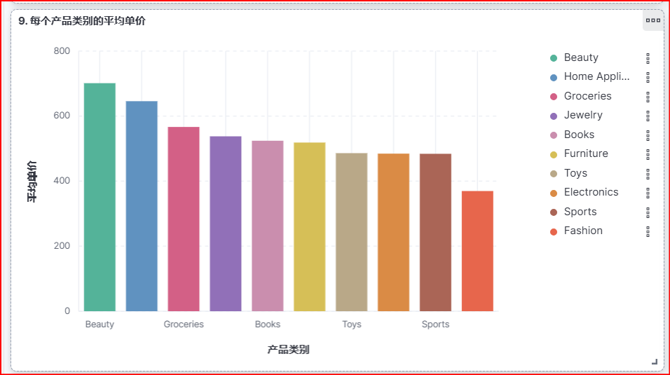
10.  找出订单数量最多的前5个城市。
```
GET /ecommerce/_search
{
  "size": 0,
  "aggs": {
    "top_5_cities_by_order_count": {
      "terms": {
        "field": "customer_city.keyword",
        "size": 5,
        "order": {
          "order_count": "desc"
        }
      },
      "aggs": {
        "order_count": {
          "value_count": {
            "field": "order_id"
          }
        }
      }
    }
  }
}
```
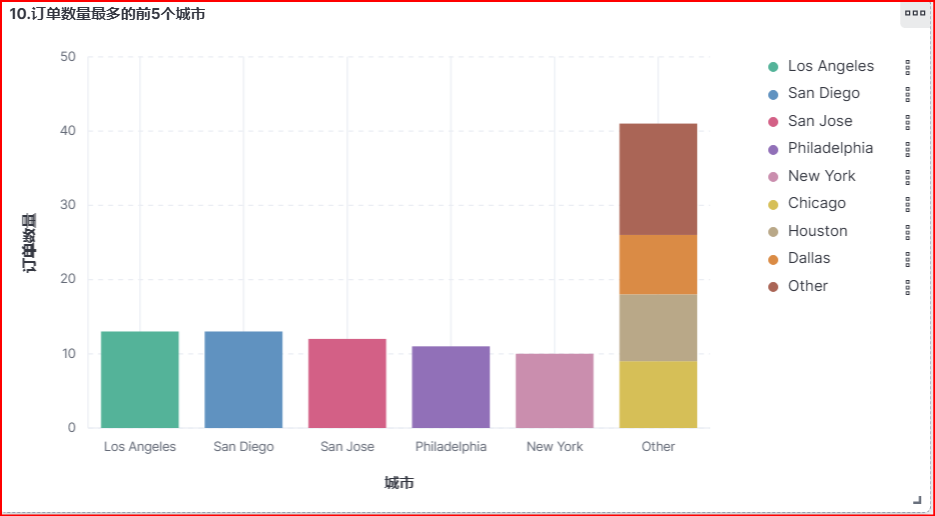
#### 仪表盘
**整体布局**
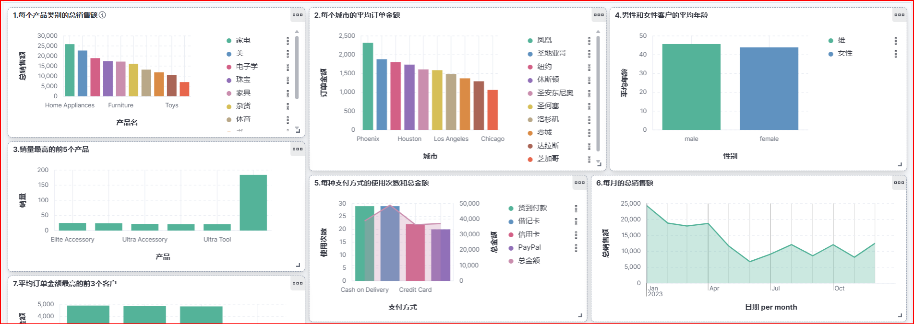
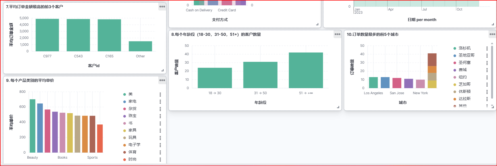
**详细图**
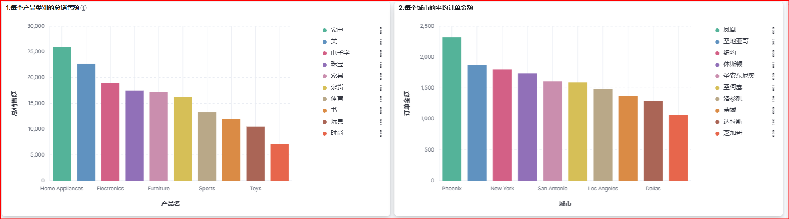
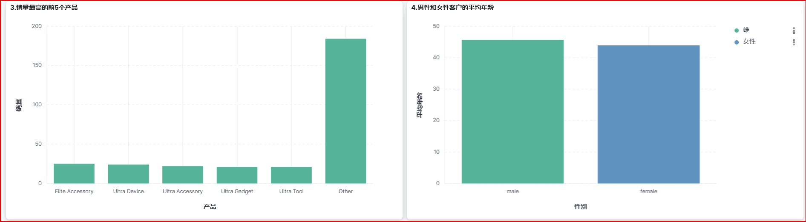
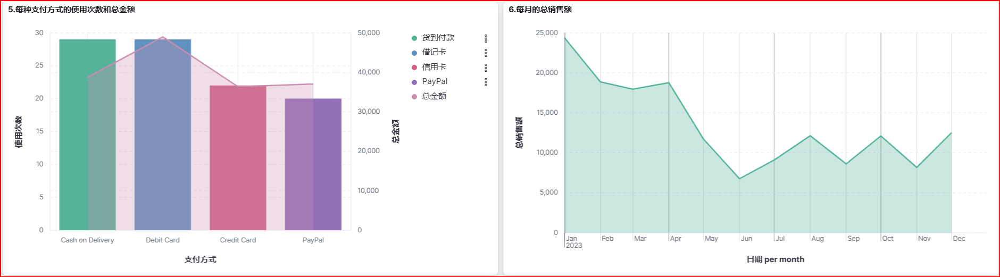
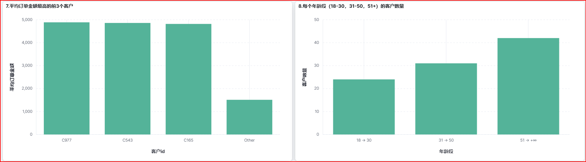
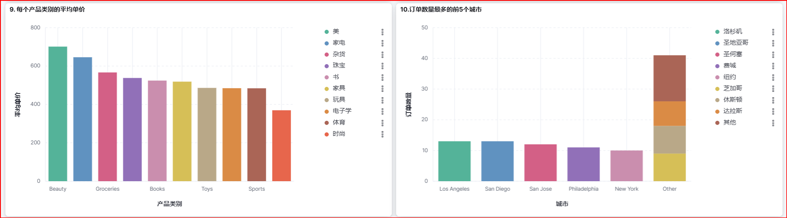
### 四、问题及解决
**1.可视化图表配置**
问题描述：
在Kibana中配置可视化图表时，我发现图表显示的数据不完整或者格式不正确。

解决方法：
我仔细检查了图表的配置选项，包括数据字段的选择和图表类型的匹配。通过调整配置，我确保了图表能够正确显示所需的数据。
**2. 仪表盘布局调整**
问题描述：
在将多个可视化图表放入仪表盘时，我发现布局混乱，难以阅读。

解决方法：
我利用Kibana的布局工具，调整了图表的大小和位置，确保了仪表盘的整洁和易读性。此外，我还添加了控件和文字描述，以增强仪表盘的信息表达能力。
**3. 筛选和控件应用**
问题描述：
在实验中，我需要根据特定的条件筛选数据，但最初在应用筛选条件时遇到了困难。

解决方法：
我学习了如何使用Kibana的筛选和控件功能，通过添加筛选条件和控件，我能够根据需要筛选数据，并在仪表盘中展示动态变化的结果。
### 五、总结
在实验过程中，我通过不断学习和实践，解决了遇到的问题，并提高了对Kibana操作的熟练度。这些问题的解决不仅加深了我对Kibana功能的理解，也提升了我解决实际问题的能力。