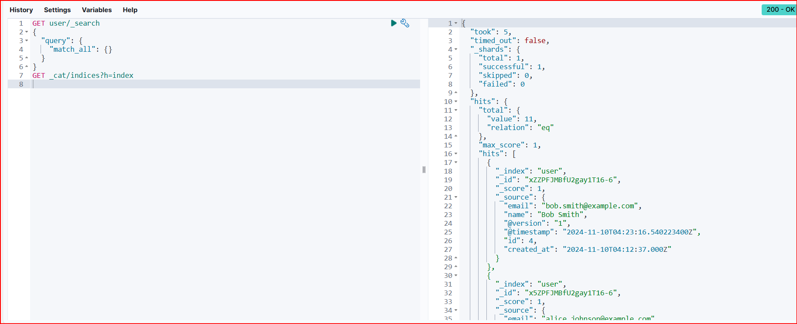

# 实验四· Logstash操作
> 学院：省级示范性软件学院
题目：《实验四· Logstash操作》
姓名：胡展奕
学号：2100160349
班级：软工2201班
日期：2024-11-10
实验环境：Elasticsearch8.12.2 Kibana8.12.2 logstash-8.12.2
---
## 一、实验内容：
Logstash 操作练习
## 二、实验步骤：
### 1.tomcat日志处理
**要求：**
1. 将tomcat的logs中的localhost_access_log访问日志导入到本地的elasticsearch中。
2. 数据导入到一个名为tomcat_logs的索引。
3. 在elasticsearch中做5个日志相关的分析，题目自拟。（提示：可以参考第04章聚合操作日志实战内容）
```
input {
       file {
         path =>  "D:\3\tomcat_logs/*"
         start_position => "beginning"
         sincedb_path => "NUL"  
       }
     }
     
     filter {
   
     
       grok {
         match => {"message" => "\[%{COMBINEDAPACHELOG}\]" }
       }
    
  
       date {
         match => [ "timestamp", "dd/MMM/yyyy:HH:mm:ss Z" ]
       }
     }
     
     output {
       elasticsearch {
         hosts => ["http://localhost:9200"]
         index => "tomcat_logs" 
       }
       stdout { codec => rubydebug }  
     }
```


#### (1)最频繁访问的URL：
```
GET tomcat_logs/_search
{
  "size": 0,
  "aggs": {
    "top_requests": {
      "terms": {
        "field": "request.keyword",
        "size": 10
      }
    }
  }
}
```

#### (2)按状态码统计请求次数:
```
GET tomcat_logs/_search
{
  "size": 0,
  "aggs": {
    "status_codes": {
      "terms": {
        "field": "response"
      }
    }
  }
}
```

#### (3)按小时统计请求次数：
```
GET tomcat_logs/_search
{
  "size": 0,
  "aggs": {
    "requests_per_hour": {
      "date_histogram": {
        "field": "timestamp",
        "calendar_interval": "hour"
      }
    }
  }
}
```

#### (4)错误请求统计：
```
GET tomcat_logs/_search
{
  "size": 0,
  "query": {
    "range": {
      "response": {
        "gte": 400,
        "lte": 599
      }
    }
  },
  "aggs": {
    "error_requests": {
      "value_count": {
        "field": "response"
      }
    }
  }
}
```

#### (5)请求响应时间分析：
```
GET tomcat_logs/_search
{
  "size": 0,
  "aggs": {
    "response_time": {
      "stats": {
        "field": "response_time"
      }
    }
  }
}
```

### 2.数据转换和传输
**要求：**
1. 将本地的mysql数据库中的一张表导入到本地的elasticsearch中。
2. 数据库表更新后，数据能够自动同步到elasticsearch中。
#### (1)准备MySQL数据库：
**确保MySQL数据库中有一张待导入的表**

#### (2)使用Logstash进行数据导入和同步
```
input {
  jdbc {
    jdbc_connection_string => "jdbc:mysql://localhost:3306/dev"
    jdbc_user => "root"
    jdbc_password => "h2528468827"
    jdbc_driver_class => "com.mysql.cj.jdbc.Driver"
    jdbc_driver_library => "D:\工具\mysql-connector-j-9.1.0.jar"
    statement => "SELECT * FROM users"
  }
}
output {
  elasticsearch {
    hosts => ["localhost:9200"]
    index => "user" 
  }
}
```


#### (3)数据同步
**插入前**


**插入后**




## 三、问题及解决办法

- **问题1：Tomcat日志导入时格式不匹配**
  
-  **解决办法**：在Logstash配置中使用`grok`过滤器来解析Tomcat日志的复杂格式。确保`grok`模式与日志的实际格式相匹配。如果默认模式不适用，可能需要自定义模式或更新`grok`模式库以支持特定版本的Tomcat日志格式。
  
-  **问题2：Elasticsearch中数据未更新**
  
-  **解决办法**：检查Logstash到Elasticsearch的输出配置，确保索引名称和文档类型设置正确。确认Logstash的同步配置，包括任何可能的过滤规则，以确保数据被正确地发送到Elasticsearch。检查MySQL数据库连接设置，确保Logstash能够成功连接并查询数据库。
  
-  **问题3：JDBC连接问题**
  
-  **解决办法**：确保JDBC驱动程序的路径正确，并且驱动程序版本与MySQL服务器版本兼容。检查数据库URL、用户名和密码是否正确。如果问题仍然存在，可能需要检查数据库服务器的网络设置和防火墙规则。
  
-  **问题4：Logstash配置错误**
  
-  **解决办法**：仔细检查Logstash配置文件的语法，特别是对于插件的配置参数。使用`logstash -f your-config-file.conf --configtest`命令来测试配置文件的语法是否正确。
  
-  **问题5：数据丢失或不一致**
  
- **解决办法**：检查是否有数据转换或字段映射错误。使用`stdout`输出来调试和验证Logstash处理的数据。确保所有的字段都被正确地映射和转换。

### 结论

通过本次实验，我不仅深入了解了Logstash的配置和使用，还学会了如何将Tomcat日志和MySQL数据有效地导入到Elasticsearch中。我学会了如何使用`grok`过滤器处理复杂的日志格式，以及如何通过调整同步配置来确保数据的一致性和完整性。此外，我还掌握了如何调试和解决常见的Logstash问题，这些经验对于我未来在数据处理和分析领域的学习和工作都是非常宝贵的。通过这些实践，我对数据流的处理有了更深刻的理解，为进一步探索大数据技术打下了坚实的基础。